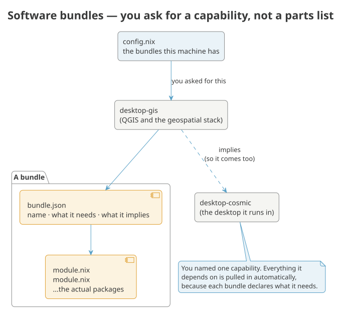

# Software bundles

A **bundle** is a directory under `software/` carrying a `bundle.json` next
to the NixOS modules it describes. A host names the bundles it wants in
`hosts/<name>/config.nix`:

```nix
bundles = [
  "base"
  "desktop-environments-cosmic"
  "desktop-browsers"
  "services-system"
];
```

When a host names a bundle, everything that bundle depends on comes with it:

{ .kz-figure }

That's the installer's default set — a minimal base system plus a minimal
COSMIC desktop. Everything else in the registry is listed too, commented
out, right there in the file, so `config.nix` doubles as its own menu.

## Every bundle at a glance

Every bundle GISNIX ships, with a one-line description — enough to see what is
available without reading through what each one contains. Follow a name for its
full package list. A *(choice)* set is one you pick a single member from,
*(required)* can't be removed from a host that has it, and *(opt-in)* is never
added unless you ask for it by name. This list is generated from the registry,
so it's always complete.

<!-- BEGIN bundles-at-a-glance (generated — do not edit by hand) -->
| Bundle | What it is |
| --- | --- |
| [`base`](../references/bundles.md#base) *(required)* | Everything a machine needs to be a usable machine: ZFS root and its bootloader, the memory guard a swapless host depends on, the login shell, the terminal emulator and the core command-line tools. A host taking only this is minimal but not crippled. |
| [`base-kernel`](../references/bundles.md#base-kernel) *(choice)* | Which kernel this machine boots. Exactly one — a host takes `stable` or `latest`, never both. Every host here boots an encrypted ZFS root, so the kernel and the OpenZFS module must come from the same package set; each member below pairs them itself. |
| [`terminal-ai`](../references/bundles.md#terminal-ai) | AI assistants, each bubblewrap-sandboxed so a compromised one cannot reach your SSH agent. Opt-in: local-llm alone pulls the ROCm stack into the closure. |
| [`terminal-chat`](../references/bundles.md#terminal-chat) | Terminal chat and forum clients: discourse-tui, tut, perch, siggy — Discourse, Mastodon, Bluesky and Signal. Its own bundle, a sibling to terminal-tuis rather than a file inside it, so it shows up as its own selectable group and installs all four the moment a host takes it — no host wants any of them by default, but a host that takes this bundle wants what it names. To keep only some: programs.terminal-chat.enableAll = false; plus the specific programs.terminal-chat.apps.<id>.enable = true; lines. |
| [`terminal-editor`](../references/bundles.md#terminal-editor) | Neovim, configured through nvf, with the EDITOR and vim/vi wiring that goes with it. Its own bundle rather than part of terminal-tuis because the plugin set builds from source — a crates.io fetch that has failed on hosts whose store cannot reach this flake's inputs, and the reason a host behind such a store takes the rest of the TUIs without it. |
| [`terminal-tuis`](../references/bundles.md#terminal-tuis) | Full-screen terminal applications: yazi and Midnight Commander for files, lazygit for git, aerc for mail, btop and friends for watching the machine, khal and khard for calendars and contacts. nmtui is not here because it is not a package — it ships inside networkmanager, which services-network enables. Chat/forum TUIs (Discourse, Mastodon, Bluesky, Signal) are the terminal-chat bundle, a sibling of this one. |
| [`desktop-browsers`](../references/bundles.md#desktop-browsers) | Web browsers. |
| [`desktop-comms`](../references/bundles.md#desktop-comms) | Talking to people and moving files between machines you own. |
| [`desktop-ebook-readers`](../references/bundles.md#desktop-ebook-readers) | E-book readers and library management. |
| [`desktop-essentials`](../references/bundles.md#desktop-essentials) | Desktop-environment-agnostic pieces every graphical session needs: fonts, file manager, clipboard, notifications, document viewers, screen capture. |
| [`desktop-games`](../references/bundles.md#desktop-games) | Games and emulators. |
| [`desktop-gis`](../references/bundles.md#desktop-gis) | QGIS and the geospatial desktop, on the packaged binary channels. Several QGIS versions install side by side deliberately — that is how a GIS workstation is used. |
| [`desktop-kartoza-apps`](../references/bundles.md#desktop-kartoza-apps) | Endpoint monitoring, a terminal typing-practice game, and general-purpose web-app launchers (Chromium app-mode shortcuts for Gmail, Calendar, Meet, LinkedIn, and around twenty others — see programs.kartoza-webapps in kartoza-webapps/default.nix). Nothing here is Kartoza-internal; a downstream flake with genuinely private tooling (an internal ERP, timesheets, a private Sentry instance) adds its own bundle alongside this one rather than folding it in here. |
| [`desktop-multimedia`](../references/bundles.md#desktop-multimedia) | Audio and video creation: screen recording and streaming, and editors tracking nixpkgs-unstable. |
| [`desktop-productivity`](../references/bundles.md#desktop-productivity) | Getting work done: the office and creative suite, mail and calendar, and screen annotation for presentations. |
| [`desktop-remote`](../references/bundles.md#desktop-remote) | Screens from somewhere else: remote desktop, phone mirroring, and receiving AirPlay. |
| [`desktop-environments-cosmic`](../references/bundles.md#desktop-environments-cosmic) | The COSMIC desktop itself: compositor, greeter, core applications, the Kartoza App Library icon, the screenshot and GIF-recording glue, and the SSH/GPG agent wiring that goes with a graphical session. The community extensions and applets are a separate bundle, because they source build. |
| [`desktop-essentials-extras`](../references/bundles.md#desktop-essentials-extras) | Desktop extras beyond the minimum a COSMIC session needs: clipboard history, document/image viewers, screen recording, disk management, and standalone volume/network applets. Split out so a fast first install can skip them and add them back with `gisnix configure` once there's a GUI to do it from. |
| [`desktop-gis-source-builds`](../references/bundles.md#desktop-gis-source-builds) *(opt-in)* | QGIS compiled from the git heads — master (dev), the latest release branch, and the LTR branch — for testing in-progress bug fixes before they ship. Opt-in: hours of build time on top of the binary channels. |
| [`desktop-kartoza-apps-screencaster`](../references/bundles.md#desktop-kartoza-apps-screencaster) *(opt-in)* | Kartoza Screencaster: screen/webcam/audio recording with a TUI, autostarted into the system tray. Experimental — the upstream build has a known CGO_ENABLED issue (see the module's own comment) — so it's opt-in rather than part of desktop-kartoza-apps' always-on set. |
| [`desktop-environments-cosmic-extensions`](../references/bundles.md#desktop-environments-cosmic-extensions) *(opt-in)* | COSMIC's community extensions and panel applets: calculator, tweaks, cosmic-ctl, the weather, sysinfo, caffeine, brightness and privacy-indicator applets, and the fingerprint enrolment GUI. |
| [`desktop-gis-versions-qgis-1-8`](../references/bundles.md#desktop-gis-versions-qgis-1-8) *(opt-in)* | QGIS 1.8 pinned (1.8.0, the last 1.8.x that nixpkgs shipped), a vintage Qt4/Python2 build with no extra python packages; may no longer evaluate or have every binary cached. |
| [`desktop-gis-versions-qgis-2-10`](../references/bundles.md#desktop-gis-versions-qgis-2-10) *(opt-in)* | QGIS 2.10 pinned (2.10.1, the last 2.10.x that nixpkgs shipped), a vintage Qt4/Python2 build with no extra python packages; may no longer evaluate or have every binary cached. |
| [`desktop-gis-versions-qgis-2-16`](../references/bundles.md#desktop-gis-versions-qgis-2-16) *(opt-in)* | QGIS 2.16 pinned (2.16.2, the last 2.16.x that nixpkgs shipped), a vintage Qt4/Python2 build with no extra python packages; may no longer evaluate or have every binary cached. |
| [`desktop-gis-versions-qgis-2-18`](../references/bundles.md#desktop-gis-versions-qgis-2-18) *(opt-in)* | QGIS 2.18 pinned (2.18.28, the last 2.18.x that nixpkgs shipped), a vintage Qt4/Python2 build with no extra python packages; may no longer evaluate or have every binary cached. |
| [`desktop-gis-versions-qgis-2-4`](../references/bundles.md#desktop-gis-versions-qgis-2-4) *(opt-in)* | QGIS 2.4 pinned (2.4.0, the last 2.4.x that nixpkgs shipped), a vintage Qt4/Python2 build with no extra python packages; may no longer evaluate or have every binary cached. |
| [`desktop-gis-versions-qgis-2-6`](../references/bundles.md#desktop-gis-versions-qgis-2-6) *(opt-in)* | QGIS 2.6 pinned (2.6.1, the last 2.6.x that nixpkgs shipped), a vintage Qt4/Python2 build with no extra python packages; may no longer evaluate or have every binary cached. |
| [`desktop-gis-versions-qgis-2-8`](../references/bundles.md#desktop-gis-versions-qgis-2-8) *(opt-in)* | QGIS 2.8 pinned (2.8.2, the last 2.8.x that nixpkgs shipped), a vintage Qt4/Python2 build with no extra python packages; may no longer evaluate or have every binary cached. |
| [`desktop-gis-versions-qgis-3-10`](../references/bundles.md#desktop-gis-versions-qgis-3-10) *(opt-in)* | QGIS 3.10 pinned (3.10.13, the last 3.10.x that nixpkgs shipped), installed with the standard python packages from its own pinned nixpkgs — pure binary-cache hits, no source builds. |
| [`desktop-gis-versions-qgis-3-16`](../references/bundles.md#desktop-gis-versions-qgis-3-16) *(opt-in)* | QGIS 3.16 pinned (3.16.14, the last 3.16.x that nixpkgs shipped), installed with the standard python packages from its own pinned nixpkgs — pure binary-cache hits, no source builds. |
| [`desktop-gis-versions-qgis-3-22`](../references/bundles.md#desktop-gis-versions-qgis-3-22) *(opt-in)* | QGIS 3.22 pinned (3.22.16, the last 3.22.x that nixpkgs shipped), installed with the standard python packages from its own pinned nixpkgs — pure binary-cache hits, no source builds. |
| [`desktop-gis-versions-qgis-3-24`](../references/bundles.md#desktop-gis-versions-qgis-3-24) *(opt-in)* | QGIS 3.24 pinned (3.24.2, the last 3.24.x that nixpkgs shipped), installed with the standard python packages from its own pinned nixpkgs — pure binary-cache hits, no source builds. |
| [`desktop-gis-versions-qgis-3-26`](../references/bundles.md#desktop-gis-versions-qgis-3-26) *(opt-in)* | QGIS 3.26 pinned (3.26.2, the last 3.26.x that nixpkgs shipped), installed with the standard python packages from its own pinned nixpkgs — pure binary-cache hits, no source builds. |
| [`desktop-gis-versions-qgis-3-28`](../references/bundles.md#desktop-gis-versions-qgis-3-28) *(opt-in)* | QGIS 3.28 pinned (3.28.15, the last 3.28.x that nixpkgs shipped), installed with the standard python packages from its own pinned nixpkgs — pure binary-cache hits, no source builds. |
| [`desktop-gis-versions-qgis-3-32`](../references/bundles.md#desktop-gis-versions-qgis-3-32) *(opt-in)* | QGIS 3.32 pinned (3.32.3, the last 3.32.x that nixpkgs shipped), installed with the standard python packages from its own pinned nixpkgs — pure binary-cache hits, no source builds. |
| [`desktop-gis-versions-qgis-3-34`](../references/bundles.md#desktop-gis-versions-qgis-3-34) *(opt-in)* | QGIS 3.34 pinned (3.34.15, the last 3.34.x that nixpkgs shipped), installed with the standard python packages from its own pinned nixpkgs — pure binary-cache hits, no source builds. |
| [`desktop-gis-versions-qgis-3-36`](../references/bundles.md#desktop-gis-versions-qgis-3-36) *(opt-in)* | QGIS 3.36 pinned (3.36.3, the last 3.36.x that nixpkgs shipped), installed with the standard python packages from its own pinned nixpkgs — pure binary-cache hits, no source builds. |
| [`desktop-gis-versions-qgis-3-38`](../references/bundles.md#desktop-gis-versions-qgis-3-38) *(opt-in)* | QGIS 3.38 pinned (3.38.3, the last 3.38.x that nixpkgs shipped), installed with the standard python packages from its own pinned nixpkgs — pure binary-cache hits, no source builds. |
| [`desktop-gis-versions-qgis-3-4`](../references/bundles.md#desktop-gis-versions-qgis-3-4) *(opt-in)* | QGIS 3.4 pinned (3.4.8, the last 3.4.x that nixpkgs shipped), installed with the standard python packages from its own pinned nixpkgs — pure binary-cache hits, no source builds. |
| [`desktop-gis-versions-qgis-3-40`](../references/bundles.md#desktop-gis-versions-qgis-3-40) *(opt-in)* | QGIS 3.40 pinned (3.40.15, the last 3.40.x that nixpkgs shipped), installed with the standard python packages from its own pinned nixpkgs — pure binary-cache hits, no source builds. |
| [`desktop-gis-versions-qgis-3-42`](../references/bundles.md#desktop-gis-versions-qgis-3-42) *(opt-in)* | QGIS 3.42 pinned (3.42.3, the last 3.42.x that nixpkgs shipped), installed with the standard python packages from its own pinned nixpkgs — pure binary-cache hits, no source builds. |
| [`desktop-gis-versions-qgis-3-44`](../references/bundles.md#desktop-gis-versions-qgis-3-44) *(opt-in)* | QGIS 3.44 pinned (3.44.12, the last 3.44.x that nixpkgs shipped), installed with the standard python packages from its own pinned nixpkgs — pure binary-cache hits, no source builds. |
| [`desktop-gis-versions-qgis-3-8`](../references/bundles.md#desktop-gis-versions-qgis-3-8) *(opt-in)* | QGIS 3.8 pinned (3.8.0, the last 3.8.x that nixpkgs shipped), installed with the standard python packages from its own pinned nixpkgs — pure binary-cache hits, no source builds. |
| [`desktop-gis-versions-qgis-4-0`](../references/bundles.md#desktop-gis-versions-qgis-4-0) *(opt-in)* | QGIS 4.0 pinned (4.0.3, the last 4.0.x that nixpkgs shipped), installed with the standard python packages from its own pinned nixpkgs — pure binary-cache hits, no source builds. |
| [`services-device`](../references/bundles.md#services-device) | Hardware every machine benefits from: Bluetooth and firmware updates. Anything depending on what is actually plugged in is a sub-bundle. |
| [`services-dns`](../references/bundles.md#services-dns) | DNS filtering: blocky as the local resolver, plus the firewall rules that stop applications bypassing it over DoH. Fleet-wide policy. |
| [`services-network`](../references/bundles.md#services-network) | Network presence: mDNS service discovery, and the overlay VPN. Tailscale here is being replaced by NetBird. |
| [`services-sync`](../references/bundles.md#services-sync) | File synchronisation between machines and to cloud storage. |
| [`services-system`](../references/bundles.md#services-system) *(required)* | What every machine needs without exception: CA trust, the fleet's /etc/hosts, kernel hardening, sshd, the unfree allow-list, audio and Flatpak. |
| [`services-virtualisation`](../references/bundles.md#services-virtualisation) | Running things that are not native to this machine: containers, virtual machines, cross-architecture emulation, Windows compatibility. |
| [`services-device-input`](../references/bundles.md#services-device-input) | Vendor input hardware: Dygma/Bazecor configurator, Razer RGB/DPI, generic mouse configurators. Kanata's own keyboard remapping is the services-device-input-kanata bundle instead — it needs no vendor hardware and ships on by default, unlike the daemons and kernel modules here. |
| [`services-device-input-kanata`](../references/bundles.md#services-device-input-kanata) | Kanata keyboard remapping: home-row mods, a navigation layer, and layout-aware chords (see docs/user/keyboard.md). Generic — matches every keyboard, needs no vendor hardware. On by default; a sibling of services-device-input rather than a child of it, so this stays on when the vendor-specific tools there (Bazecor, OpenRazer, Piper) are turned off. |
| [`services-device-mobile`](../references/bundles.md#services-device-mobile) | Phones and tablets: iOS mounting and display control. |
| [`services-device-peripherals`](../references/bundles.md#services-device-peripherals) *(opt-in)* | Hardware only some machines have: fingerprint readers, scanners, graphics tablets, game controllers. Each pulls in daemons a host without the device has no use for — and biometrics can affect whether you can log in, which is why this is never taken by default. |
| [`services-device-printing`](../references/bundles.md#services-device-printing) | CUPS and printer drivers. Its own bundle despite holding one module: printing turned out to be the peripheral most hosts actually want, and folding it into the opt-in peripherals group silently cost five machines their printers. A singleton is the lesser problem. |
| [`services-system-boot-themes`](../references/bundles.md#services-system-boot-themes) *(choice)* | GRUB and Plymouth branding. Alternatives — a host boots with one splash, and its GRUB menu matches it. Each member is the Plymouth/GRUB pair, because a Kartoza menu handing over to a QGIS splash reads as a fault. |
| [`services-system-console`](../references/bundles.md#services-system-console) | The text console: login banner, message of the day, and fonts that make a high-DPI TTY readable. |
| [`services-system-power`](../references/bundles.md#services-system-power) | Power management: battery thresholds, suspend behaviour, SSD trim. Laptop concerns. |
| [`services-system-storage`](../references/bundles.md#services-system-storage) | Filesystem support and snapshot scheduling: NTFS for external drives, sanoid for automatic ZFS snapshots, and a manual ZFS backup TUI for offloading snapshots to an external drive. |
| [`security`](../references/bundles.md#security) | Credentials and keys: the password manager, and the hardware tokens with their udev rules and daemons. Grouped by what they are for rather than whether they are hardware. |
| [`locale`](../references/bundles.md#locale) *(choice)* | Per-country locale, keyboard layout and timezone. A host takes exactly one, named as `locale = "pt-en";`. |
<!-- END bundles-at-a-glance -->

## Changing what's installed

Uncomment (or add) a bundle name, then rebuild:

```bash
gisnix update
```

Comment one out and rebuild to remove it. `base` and `services-system` are
load-bearing (ZFS root and its bootloader; audio, certificates, hardening)
— removing them doesn't shrink the install, it breaks it.

## Implications

Some bundles imply others: taking `desktop-gis` (QGIS) automatically pulls
in `desktop-environments-cosmic`, because QGIS needs a desktop to display
in. You never have to work that out by hand — `profiles/bundles.nix`
resolves the full closure of implications at eval time. The
[bundle reference](../references/bundles.md) shows what implies what.

## Where the picker fits in

On a full GISNIX checkout (not the tiny per-machine flake the installer
generates), `gisnix configure` gives you the same bundle selection as an
interactive menu — search, tick boxes, see what each thing installs before
committing. It's the exact same picker the installer's own software step
opens. See [the installer](../developer/installer.md) for how that's wired.
