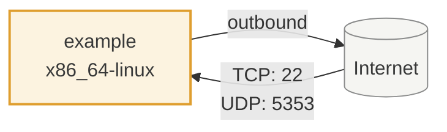
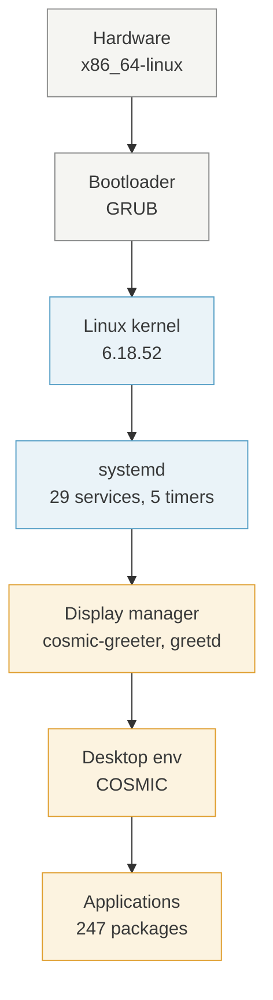

<!-- SPDX-FileCopyrightText: Tim Sutton -->
<!-- SPDX-License-Identifier: MIT -->

HOST · EXAMPLE

# example

_This page is generated by `nix run .#docs-generate-hosts`. Do not hand-edit — your changes will be overwritten._

## Network interactions

_How this host connects to the Internet, the Tailscale mesh, and the rest of the Kartoza fleet — derived from firewall rules and `services.tailscale.enable`._

## Deployment stack

_Layered view of the software stack on this host — from hardware up through systemd, the display manager, and desktop applications._

## Identity

| Field | Value |
| --- | --- |
| Hostname | `example` |
| Domain | _(none)_ |
| System | `x86_64-linux` |
| Time zone | `Africa/Johannesburg` |

## Boot & kernel

| Field | Value |
| --- | --- |
| Kernel | `6.18.52` |
| Bootloader | GRUB |
| Filesystems | `vfat`, `xfs`, `zfs` |

## Storage topology

_Declared filesystems and ZFS pools — from `config.fileSystems` and `boot.zfs.extraPools`._

**ZFS pools:** `NIXROOT`

| Mountpoint | Device | Type |
| --- | --- | --- |
| `/` | `NIXROOT/root` | `zfs` |
| `/boot` | `/dev/disk/by-partlabel/disk-main-ESP` | `vfat` |
| `/home` | `NIXROOT/home` | `zfs` |
| `/nix` | `NIXROOT/nix` | `zfs` |
| `/overflow` | `NIXROOT/overflow` | `zfs` |
| `/var/atuin` | `/dev/zvol/NIXROOT/atuin` | `xfs` |

## Firewall

Firewall is **enabled**.

### Open TCP ports

`22`

### Open UDP ports

`5353`

## Desktop environment

`COSMIC`

**Display manager:** `cosmic-greeter`, `greetd`

## Services started at boot

_Taken from `config.systemd.services` filtered to units wanted by `multi-user.target`, `default.target`, or `graphical.target`, with each unit's own `Description=`._

| Service | Description |
| --- | --- |
| `NetworkManager` | — |
| `NetworkManager-dispatcher` | — |
| `accounts-daemon` | — |
| `acpid` | ACPI Daemon |
| `avahi-daemon` | Avahi mDNS/DNS-SD Stack |
| `blocky` | A DNS proxy and ad-blocker for the local network |
| `cosmic-greeter-daemon` | — |
| `cpufreq` | CPU Frequency Setup |
| `cups-browsed` | CUPS Remote Printer Discovery |
| `fail2ban` | — |
| `greetd` | — |
| `kanata-keyboard` | — |
| `lastlog2-import` | — |
| `linger-users` | — |
| `logrotate-checkconf` | Logrotate configuration check |
| `mandb` | — |
| `nscd` | Name Service Cache Daemon (nsncd) |
| `plymouth-quit` | — |
| `plymouth-quit-wait` | — |
| `post-boot` | Post-Boot Actions |
| `reload-systemd-vconsole-setup` | Reset console on configuration changes |
| `spice-vdagentd` | spice-vdagent daemon |
| `sshd` | SSH Daemon |
| `sshd-keygen` | SSH Host Keys Generation |
| `system76-scheduler` | Manage process priorities and CFS scheduler latencies for improved responsiveness on the desktop |
| `systemd-modules-load` | — |
| `systemd-oomd` | — |
| `systemd-sysctl` | — |
| `wpa_supplicant` | WPA Supplicant instance |

## Scheduled timers

_Systemd timers wanted by `timers.target` — scheduled jobs that fire on this host._

|  |  |  |
| --- | --- | --- |
| `fstrim` | `fwupd-refresh` | `logrotate` |
| `zfs-scrub` | `zpool-trim` |  |

!!! info "Highlights"
    - OpenSSH server enabled (`services.openssh.enable`).

## Users

| Name | UID | Description | Shell |
| --- | --- | --- | --- |
| example |  | Example User |  |

## Installed software

_247 packages declared in `environment.systemPackages`, grouped by where the flake declares them. Descriptions come from the exact nixpkgs revision the flake pins, via the [software catalogue](../references/software.md)._

### Base (48)

_Everything a machine needs to be a usable machine: ZFS root and its bootloader, the memory guard a swapless host depends on, the login shell, the terminal emulator and the core command-line tools. A host taking only this is minimal but not crippled._

| Package | Description |
| --- | --- |
| `asciinema` | Terminal session recorder and the best companion of asciinema.org |
| `asciinema-scenario` | Create asciinema videos from a text file |
| `atuin` | Replacement for a shell history which records additional commands context with optional encrypted synchronization between machines |
| `bat` | Cat(1) clone with syntax highlighting and Git integration |
| `chafa` | Terminal graphics for the 21st century |
| `comma` | Runs programs without installing them |
| `cpufetch` | Simplistic yet fancy CPU architecture fetching tool |
| `deploy-fish-config` | — |
| `direnv` | Shell extension that manages your environment |
| `duf` | Disk Usage/Free Utility |
| `eza` | Modern, maintained replacement for ls |
| `fd` | Simple, fast and user-friendly alternative to find |
| `ffmpegthumbnailer` | Lightweight video thumbnailer |
| `fish` | Smart and user-friendly command line shell |
| `fzf` | Command-line fuzzy finder written in Go |
| `gh` | GitHub CLI tool |
| `git` | Distributed version control system |
| `gnumake` | Tool to control the generation of non-source files from sources |
| `gping` | Ping, but with a graph |
| `herdr` | Agent multiplexer that lives in your terminal |
| `kitty` | Fast, feature-rich, GPU based terminal emulator |
| `mdcat` | cat for markdown |
| `neo-cowsay` | Cowsay reborn, written in Go |
| `nix-direnv` | Fast, persistent use_nix implementation for direnv |
| `nix-prefetch-github` | Prefetch sources from github |
| `nix-search-tv` | Fuzzy search for Nix packages |
| `nixfmt` | Official formatter for Nix code |
| `octofetch` | Github user information on terminal |
| `onefetch` | Git repository summary on your terminal |
| `pgcli` | Command-line interface for PostgreSQL |
| `poppler-utils` | PDF rendering library |
| `powertop` | Analyze power consumption on Intel-based laptops |
| `ramfetch` | Tool which displays memory information |
| `restic` | Backup program that is fast, efficient and secure |
| `rpl` | Replace strings in files |
| `rsync` | Fast incremental file transfer utility |
| `show-aliases` | — |
| `starfetch` | CLI star constellations displayer |
| `starship` | Minimal, blazing fast, and extremely customizable prompt for any shell |
| `t-rec` | Blazingly fast terminal recorder that generates animated gif images for the web written in rust |
| `tailspin` | Log file highlighter |
| `unlock-host` | — |
| `unzip` | Extraction utility for archives compressed in .zip format |
| `usbutils` | Tools for working with USB devices, such as lsusb |
| `wget` | Tool for retrieving files using HTTP, HTTPS, and FTP |
| `writedisk` | Small utility for writing a disk image to a USB drive |
| `zfxtop` | Fetch top for gen Z with X written by bubbletea enjoyer |
| `zoxide` | Fast cd command that learns your habits |

### Desktop · Browsers (4)

_Web browsers._

| Package | Description |
| --- | --- |
| `brave` | Privacy-oriented browser for Desktop and Laptop computers |
| `firefox` | Web browser built from Firefox source tree |
| `google-chrome` | Freeware web browser developed by Google |
| `ungoogled-chromium` | Open source web browser from Google, with dependencies on Google web services removed |

### Desktop · Essentials (15)

_Desktop-environment-agnostic pieces every graphical session needs: fonts, file manager, clipboard, notifications, document viewers, screen capture._

| Package | Description |
| --- | --- |
| `fira` | Font family including Fira Sans and Fira Mono |
| `fira-code` | Monospace font with programming ligatures |
| `fira-code-symbols` | FiraCode unicode ligature glyphs in private use area |
| `grim` | Grab images from a Wayland compositor |
| `jetbrains-mono` | Typeface made for developers |
| `libnotify` | Library that sends desktop notifications to a notification daemon |
| `nautilus` | File manager for GNOME |
| `noto-fonts` | Beautiful and free fonts for many languages |
| `noto-fonts-cjk-sans` | Beautiful and free fonts for CJK languages |
| `noto-fonts-color-emoji` | Color emoji font |
| `satty` | Screenshot annotation tool inspired by Swappy and Flameshot |
| `slurp` | Select a region in a Wayland compositor |
| `wayland-utils` | Wayland utilities (wayland-info) |
| `wl-clipboard` | Command-line copy/paste utilities for Wayland |
| `xdg-utils` | Set of command line tools that assist applications with a variety of desktop integration tasks |

### Desktop · Multimedia (1)

_Audio and video creation: screen recording and streaming, and editors tracking nixpkgs-unstable._

| Package | Description |
| --- | --- |
| `ffmpeg-full` | Complete, cross-platform solution to record, convert and stream audio and video |

### Desktop · Environments · Cosmic (19)

_The COSMIC desktop itself: compositor, greeter, core applications, the Kartoza App Library icon, the screenshot and GIF-recording glue, and the SSH/GPG agent wiring that goes with a graphical session. The community extensions and applets are a separate bundle, because they source build._

| Package | Description |
| --- | --- |
| `capture-trigger` | — |
| `cosmic-edit` | Text Editor for the COSMIC Desktop Environment |
| `cosmic-icons` | System76 Cosmic icon theme for Linux |
| `cosmic-monitor` | COSMIC System Monitor |
| `cosmic-player` | Media player for the COSMIC Desktop Environment |
| `cosmic-reader` | PDF reader for the COSMIC Desktop Environment |
| `cosmic-screenshot` | Screenshot tool for the COSMIC Desktop Environment |
| `cosmic-store` | App Store for the COSMIC Desktop Environment |
| `cosmic-term` | Terminal for the COSMIC Desktop Environment |
| `kartoza-cosmic-app-library-icon` | — |
| `record-gif` | — |
| `record-gif-stop` | — |
| `record-gif-toggle` | — |
| `record-gif-trigger` | — |
| `screenshot-listener` | — |
| `screenshot-satty` | — |
| `screenshot-trigger` | — |
| `seahorse` | Application for managing encryption keys and passwords in the GnomeKeyring |
| `tasks` | Simple task management application for the COSMIC desktop |

### Services · Device (2)

_Hardware every machine benefits from: Bluetooth and firmware updates. Anything depending on what is actually plugged in is a sub-bundle._

| Package | Description |
| --- | --- |
| `kanata` | Tool to improve keyboard comfort and usability with advanced customization |
| `voxtype` | Voice-to-text with push-to-talk for Wayland compositors |

### Services · DNS (1)

_DNS filtering: blocky as the local resolver, plus the firewall rules that stop applications bypassing it over DoH. Fleet-wide policy._

| Package | Description |
| --- | --- |
| `blocky` | Fast and lightweight DNS proxy as ad-blocker for local network with many features |

### Services · System (2)

_What every machine needs without exception: CA trust, the fleet's /etc/hosts, kernel hardening, sshd, the unfree allow-list, audio and Flatpak._

| Package | Description |
| --- | --- |
| `jack2` | JACK audio connection kit, version 2 with jackdbus |
| `pipewire` | Server and user space API to deal with multimedia pipelines |

### Services · Virtualisation (1)

_Running things that are not native to this machine: containers, virtual machines, cross-architecture emulation, Windows compatibility._

| Package | Description |
| --- | --- |
| `iptables` | Program to configure the Linux IP packet filtering ruleset |

### Locale (1)

_Per-country locale, keyboard layout and timezone. A host takes exactly one, named as `locale = "pt-en";`._

| Package | Description |
| --- | --- |
| `aspell` | Spell checker for many languages |

### Declared in a profile (1)

_Declared directly in a `profiles/` module rather than under `software/`._

| Package | Description |
| --- | --- |
| `baboon` | A terminal typing practice app with ASCII art |

### Provisioned by NixOS modules (152)

_Not declared by this flake. These arrive as a side effect of enabling a NixOS service or desktop module, so they have no place in the `software/` taxonomy._

| Package | Description |
| --- | --- |
| `accountsservice` | D-Bus interface for user account query and manipulation |
| `acl` | Library and tools for manipulating access control lists |
| `adwaita-icon-theme` | — |
| `agg` | Command-line tool for generating animated GIF files from asciicast files produced by asciinema terminal recorder |
| `alsa-utils` | ALSA, the Advanced Linux Sound Architecture utils |
| `aspell-dict-uk` | Aspell dictionary for Ukrainian |
| `at-spi2-core` | Assistive Technology Service Provider Interface protocol definitions and daemon for D-Bus |
| `attr` | Library and tools for manipulating extended attributes |
| `avahi` | mDNS/DNS-SD implementation |
| `bash-interactive` | GNU Bourne-Again Shell, the de facto standard shell on Linux (for interactive use) |
| `bcache-tools` | User-space tools required for bcache (Linux block layer cache) |
| `bind` | Domain name server |
| `bluez` | Official Linux Bluetooth protocol stack |
| `bzip2` | High-quality data compression program |
| `coreutils-full` | GNU Core Utilities |
| `cosmic-applets` | Applets for the COSMIC Desktop Environment |
| `cosmic-applibrary` | Application Template for the COSMIC Desktop Environment |
| `cosmic-bg` | Applies Background for the COSMIC Desktop Environment |
| `cosmic-comp` | Compositor for the COSMIC Desktop Environment |
| `cosmic-files` | File Manager for the COSMIC Desktop Environment |
| `cosmic-greeter` | Greeter for the COSMIC Desktop Environment |
| `cosmic-idle` | Idle daemon for the COSMIC Desktop Environment |
| `cosmic-initial-setup` | COSMIC Initial Setup |
| `cosmic-launcher` | Launcher for the COSMIC Desktop Environment |
| `cosmic-notifications` | Notifications for the COSMIC Desktop Environment |
| `cosmic-osd` | OSD for the COSMIC Desktop Environment |
| `cosmic-panel` | Panel for the COSMIC Desktop Environment |
| `cosmic-randr` | Library and utility for displaying and configuring Wayland outputs |
| `cosmic-session` | Session manager for the COSMIC desktop environment |
| `cosmic-settings` | Settings for the COSMIC Desktop Environment |
| `cosmic-settings-daemon` | Settings Daemon for the COSMIC Desktop Environment |
| `cosmic-wallpapers` | Wallpapers for the COSMIC Desktop Environment |
| `cosmic-workspaces-epoch` | Workspaces Epoch for the COSMIC Desktop Environment |
| `cpio` | Program to create or extract from cpio archives |
| `cpupower` | Tool to examine and tune power saving features |
| `cups` | Standards-based printing system for UNIX |
| `cups-pk-helper` | PolicyKit helper to configure cups with fine-grained privileges |
| `curl` | Command line tool for transferring files with URL syntax |
| `dbus` | Simple interprocess messaging system |
| `dbus-broker` | Linux D-Bus Message Broker |
| `dconf` | — |
| `diffutils` | Commands for showing the differences between files (diff, cmp, etc.) |
| `done` | Automatically receive notifications when long processes finish |
| `dosfstools` | Utilities for creating and checking FAT and VFAT file systems |
| `du-dust` | du, but more intuitive |
| `fail2ban` | Program that scans log files for repeated failing login attempts and bans IP addresses |
| `fallback-cursor-theme` | — |
| `findutils` | GNU Find Utilities, the basic directory searching utilities of the GNU operating system |
| `flatpak` | Linux application sandboxing and distribution framework |
| `fontconfig` | Library for font customization and configuration |
| `forgit` | Utility tool powered by fzf for using git interactively |
| `fortune-mod` | Program that displays a pseudorandom message from a database of quotations |
| `fprintd` | D-Bus daemon that offers libfprint functionality over the D-Bus interprocess communication bus |
| `fuse` | Library that allows filesystems to be implemented in user space |
| `fwupd` | — |
| `gawk` | GNU implementation of the Awk programming language |
| `geoclue` | Geolocation framework and some data providers |
| `github-copilot-cli.fish` | GitHub Copilot CLI aliases for Fish Shell |
| `glib` | C library of programming buildings blocks |
| `glibc` | GNU C Library |
| `glibc-locales` | Locale information for the GNU C Library |
| `gnome-keyring` | Collection of components in GNOME that store secrets, passwords, keys, certificates and make them available to applications |
| `gnugrep` | GNU implementation of the Unix grep command |
| `gnupg` | Modern release of the GNU Privacy Guard, a GPL OpenPGP implementation |
| `gnused` | GNU sed, a batch stream editor |
| `gnutar` | GNU implementation of the `tar` archiver |
| `grub` | GNU GRUB, the Grand Unified Boot Loader |
| `gvfs` | Virtual Filesystem support library (full GNOME support) |
| `gzip` | GNU zip compression program |
| `hicolor-icon-theme` | Default fallback theme used by implementations of the icon theme specification |
| `hostname-debian` | — |
| `hydro` | Ultra-pure, lag-free prompt with async Git status |
| `imagemagick` | Software suite to create, edit, compose, or convert bitmap images |
| `iproute2` | Collection of utilities for controlling TCP/IP networking and traffic control in Linux |
| `iputils` | Set of small useful utilities for Linux networking |
| `jack-libs` | — |
| `kanata-debug` | — |
| `kanata-status` | — |
| `kanata-test` | — |
| `kanata-toggle` | — |
| `kbd` | Linux keyboard tools and keyboard maps |
| `kexec-tools` | Tools related to the kexec Linux feature |
| `kmod` | Tools for loading and managing Linux kernel modules |
| `less` | More advanced file pager than 'more' |
| `libcap` | Library for working with POSIX capabilities |
| `libressl` | Utility which reads and writes data across network connections — LibreSSL implementation |
| `linux-pam` | Pluggable Authentication Modules, a flexible mechanism for authenticating user |
| `lvm2` | Tools to support Logical Volume Management (LVM) on Linux |
| `man-db` | Implementation of the standard Unix documentation system accessed using the man command |
| `mkpasswd` | Overfeatured front-end to crypt, from the Debian whois package |
| `modemmanager` | WWAN modem manager, part of NetworkManager |
| `mtools` | Utilities to access MS-DOS disks |
| `nano` | Small, user-friendly console text editor |
| `ncurses` | Free software emulation of curses in SVR4 and more |
| `network-manager-applet` | NetworkManager control applet for GNOME |
| `networkmanager` | Network configuration and management tool |
| `nix` | Nix package manager |
| `nix-bash-completions` | Bash completions for Nix, NixOS, and NixOps |
| `nix-info` | — |
| `nixos-build-vms` | — |
| `nixos-enter` | Run a command in a NixOS chroot environment |
| `nixos-firewall-tool` | Tool to temporarily manipulate the NixOS firewall |
| `nixos-generate-config` | — |
| `nixos-icons` | Icons of the Nix logo, in Freedesktop Icon Directory Layout |
| `nixos-install` | Install bootloader and NixOS |
| `nixos-option` | Evaluate NixOS configuration and return the properties of given option |
| `nixos-rebuild-ng` | Rebuild your NixOS configuration and switch to it, on local hosts and remote |
| `nixos-version` | — |
| `openssh` | Implementation of the SSH protocol |
| `orca` | Screen reader |
| `papirus-icon-theme` | Pixel perfect icon theme for Linux |
| `patch` | GNU Patch, a program to apply differences to files |
| `perl` | Standard implementation of the Perl 5 programming language |
| `playerctl` | Command-line utility and library for controlling media players that implement MPRIS |
| `plymouth` | Boot splash and boot logger |
| `polkit` | Toolkit for defining and handling the policy that allows unprivileged processes to speak to privileged processes |
| `pop-icon-theme` | Icon theme for Pop!_OS with a semi-flat design and raised 3D motifs |
| `pop-launcher` | Modular IPC-based desktop launcher service |
| `power-profiles-daemon` | Makes user-selected power profiles handling available over D-Bus |
| `procps` | Utilities that give information about processes using the /proc filesystem |
| `pulseaudio` | Sound server for POSIX and Win32 systems |
| `qt5ct` | Qt5 Configuration Tool |
| `qt6ct` | Qt6 Configuration Tool |
| `rtkit` | Daemon that hands out real-time priority to processes |
| `shadow` | Suite containing authentication-related tools such as passwd and su |
| `shared-mime-info` | Database of common MIME types |
| `sound-theme-freedesktop` | Freedesktop reference sound theme |
| `speech-dispatcher` | Common interface to speech synthesis |
| `spice-vdagent` | Enhanced SPICE integration for linux QEMU guest |
| `strace` | System call tracer for Linux |
| `sudo` | Command to run commands as root |
| `system76-scheduler` | System76 Scheduler |
| `systemd` | System and service manager for Linux |
| `texinfo-interactive` | GNU documentation system |
| `time` | Tool that runs programs and summarizes the system resources they use |
| `udisks` | Daemon, tools and libraries to access and manipulate disks, storage devices and technologies |
| `upower` | D-Bus service for power management |
| `util-linux` | Set of system utilities for Linux |
| `utils` | Bash script that provides a user-friendly interface for various NixOS management tasks |
| `which` | Shows the full path of (shell) commands |
| `wireplumber` | Modular session / policy manager for PipeWire |
| `wpa_supplicant` | Tool for connecting to WPA and WPA2-protected wireless networks |
| `X11-fonts` | — |
| `xdg-desktop-portal` | Desktop integration portals for sandboxed apps |
| `xdg-desktop-portal-cosmic` | XDG Desktop Portal for the COSMIC Desktop Environment |
| `xdg-desktop-portal-gtk` | Desktop integration portals for sandboxed apps |
| `xdg-user-dirs` | Tool to help manage well known user directories like the desktop folder and the music folder |
| `xfsprogs` | SGI XFS utilities |
| `xwayland` | X server for interfacing X11 apps with the Wayland protocol |
| `xz` | General-purpose data compression software, successor of LZMA |
| `zfs` | ZFS Filesystem Linux Userspace Tools |
| `zstd` | Zstandard real-time compression algorithm |
