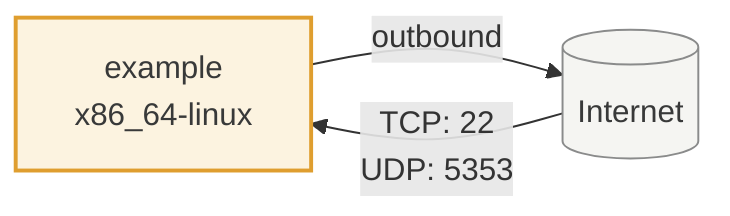
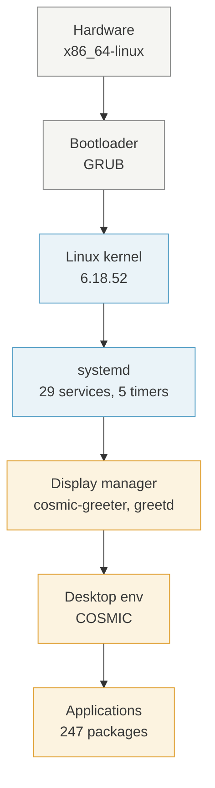

<!-- SPDX-FileCopyrightText: Tim Sutton -->
<!-- SPDX-License-Identifier: MIT -->

HOST · EXAMPLE

# example

_This page is generated by `nix run .#docs-generate-hosts`. Do not hand-edit — your changes will be overwritten._

## Network interactions

_How this host connects to the Internet, the Tailscale mesh, and the rest of the Kartoza fleet — derived from firewall rules and `services.tailscale.enable`._

## Deployment stack

_Layered view of the software stack on this host — from hardware up through systemd, the display manager, and desktop applications._

## Identity

| Field | Value |
| --- | --- |
| Hostname | `example` |
| Domain | _(none)_ |
| System | `x86_64-linux` |
| Time zone | `Africa/Johannesburg` |

## Boot & kernel

| Field | Value |
| --- | --- |
| Kernel | `6.18.52` |
| Bootloader | GRUB |
| Filesystems | `vfat`, `xfs`, `zfs` |

## Storage topology

_Declared filesystems and ZFS pools — from `config.fileSystems` and `boot.zfs.extraPools`._

**ZFS pools:** `NIXROOT`

| Mountpoint | Device | Type |
| --- | --- | --- |
| `/` | `NIXROOT/root` | `zfs` |
| `/boot` | `/dev/disk/by-partlabel/disk-main-ESP` | `vfat` |
| `/home` | `NIXROOT/home` | `zfs` |
| `/nix` | `NIXROOT/nix` | `zfs` |
| `/overflow` | `NIXROOT/overflow` | `zfs` |
| `/var/atuin` | `/dev/zvol/NIXROOT/atuin` | `xfs` |

## Firewall

Firewall is **enabled**.

### Open TCP ports

`22`

### Open UDP ports

`5353`

## Desktop environment

`COSMIC`

**Display manager:** `cosmic-greeter`, `greetd`

## Services started at boot

_Taken from `config.systemd.services` filtered to units wanted by `multi-user.target`, `default.target`, or `graphical.target`, with each unit's own `Description=`._

| Service | Description |
| --- | --- |
| `NetworkManager` | — |
| `NetworkManager-dispatcher` | — |
| `accounts-daemon` | — |
| `acpid` | ACPI Daemon |
| `avahi-daemon` | Avahi mDNS/DNS-SD Stack |
| `blocky` | A DNS proxy and ad-blocker for the local network |
| `cosmic-greeter-daemon` | — |
| `cpufreq` | CPU Frequency Setup |
| `cups-browsed` | CUPS Remote Printer Discovery |
| `fail2ban` | — |
| `greetd` | — |
| `kanata-keyboard` | — |
| `lastlog2-import` | — |
| `linger-users` | — |
| `logrotate-checkconf` | Logrotate configuration check |
| `mandb` | — |
| `nscd` | Name Service Cache Daemon (nsncd) |
| `plymouth-quit` | — |
| `plymouth-quit-wait` | — |
| `post-boot` | Post-Boot Actions |
| `reload-systemd-vconsole-setup` | Reset console on configuration changes |
| `spice-vdagentd` | spice-vdagent daemon |
| `sshd` | SSH Daemon |
| `sshd-keygen` | SSH Host Keys Generation |
| `system76-scheduler` | Manage process priorities and CFS scheduler latencies for improved responsiveness on the desktop |
| `systemd-modules-load` | — |
| `systemd-oomd` | — |
| `systemd-sysctl` | — |
| `wpa_supplicant` | WPA Supplicant instance |

## Scheduled timers

_Systemd timers wanted by `timers.target` — scheduled jobs that fire on this host._

|  |  |  |
| --- | --- | --- |
| `fstrim` | `fwupd-refresh` | `logrotate` |
| `zfs-scrub` | `zpool-trim` |  |

!!! info "Highlights"
    - OpenSSH server enabled (`services.openssh.enable`).

## Users

| Name | UID | Description | Shell |
| --- | --- | --- | --- |
| example |  | Example User |  |

## Installed software

_247 packages declared in `environment.systemPackages`, grouped by where the flake declares them. Descriptions come from the exact nixpkgs revision the flake pins, via the [software catalogue](../references/software.md)._

### Base (48)

_Everything a machine needs to be a usable machine: ZFS root and its bootloader, the memory guard a swapless host depends on, the login shell, the terminal emulator and the core command-line tools. A host taking only this is minimal but not crippled._

| Package | Description |
| --- | --- |
| `asciinema` | — |
| `asciinema-scenario` | — |
| `atuin` | — |
| `bat` | — |
| `chafa` | — |
| `comma` | — |
| `cpufetch` | — |
| `deploy-fish-config` | — |
| `direnv` | — |
| `duf` | — |
| `eza` | — |
| `fd` | — |
| `ffmpegthumbnailer` | — |
| `fish` | — |
| `fzf` | — |
| `gh` | — |
| `git` | — |
| `gnumake` | — |
| `gping` | — |
| `herdr` | — |
| `kitty` | — |
| `mdcat` | — |
| `neo-cowsay` | — |
| `nix-direnv` | — |
| `nix-prefetch-github` | — |
| `nix-search-tv` | — |
| `nixfmt` | — |
| `octofetch` | — |
| `onefetch` | — |
| `pgcli` | — |
| `poppler-utils` | — |
| `powertop` | — |
| `ramfetch` | — |
| `restic` | — |
| `rpl` | — |
| `rsync` | — |
| `show-aliases` | — |
| `starfetch` | — |
| `starship` | — |
| `t-rec` | — |
| `tailspin` | — |
| `unlock-host` | — |
| `unzip` | — |
| `usbutils` | — |
| `wget` | — |
| `writedisk` | — |
| `zfxtop` | — |
| `zoxide` | — |

### Desktop · Browsers (4)

_Web browsers._

| Package | Description |
| --- | --- |
| `brave` | — |
| `firefox` | — |
| `google-chrome` | — |
| `ungoogled-chromium` | — |

### Desktop · Essentials (15)

_Desktop-environment-agnostic pieces every graphical session needs: fonts, file manager, clipboard, notifications, document viewers, screen capture._

| Package | Description |
| --- | --- |
| `fira` | — |
| `fira-code` | — |
| `fira-code-symbols` | — |
| `grim` | — |
| `jetbrains-mono` | — |
| `libnotify` | — |
| `nautilus` | — |
| `noto-fonts` | — |
| `noto-fonts-cjk-sans` | — |
| `noto-fonts-color-emoji` | — |
| `satty` | — |
| `slurp` | — |
| `wayland-utils` | — |
| `wl-clipboard` | — |
| `xdg-utils` | — |

### Desktop · Multimedia (1)

_Audio and video creation: screen recording and streaming, and editors tracking nixpkgs-unstable._

| Package | Description |
| --- | --- |
| `ffmpeg-full` | — |

### Desktop · Environments · Cosmic (19)

_The COSMIC desktop itself: compositor, greeter, core applications, the Kartoza App Library icon, the screenshot and GIF-recording glue, and the SSH/GPG agent wiring that goes with a graphical session. The community extensions and applets are a separate bundle, because they source build._

| Package | Description |
| --- | --- |
| `capture-trigger` | — |
| `cosmic-edit` | — |
| `cosmic-icons` | — |
| `cosmic-monitor` | — |
| `cosmic-player` | — |
| `cosmic-reader` | — |
| `cosmic-screenshot` | — |
| `cosmic-store` | — |
| `cosmic-term` | — |
| `kartoza-cosmic-app-library-icon` | — |
| `record-gif` | — |
| `record-gif-stop` | — |
| `record-gif-toggle` | — |
| `record-gif-trigger` | — |
| `screenshot-listener` | — |
| `screenshot-satty` | — |
| `screenshot-trigger` | — |
| `seahorse` | — |
| `tasks` | — |

### Services · Device (2)

_Hardware every machine benefits from: Bluetooth and firmware updates. Anything depending on what is actually plugged in is a sub-bundle._

| Package | Description |
| --- | --- |
| `kanata` | — |
| `voxtype` | — |

### Services · DNS (1)

_DNS filtering: blocky as the local resolver, plus the firewall rules that stop applications bypassing it over DoH. Fleet-wide policy._

| Package | Description |
| --- | --- |
| `blocky` | — |

### Services · System (2)

_What every machine needs without exception: CA trust, the fleet's /etc/hosts, kernel hardening, sshd, the unfree allow-list, audio and Flatpak._

| Package | Description |
| --- | --- |
| `jack2` | — |
| `pipewire` | — |

### Services · Virtualisation (1)

_Running things that are not native to this machine: containers, virtual machines, cross-architecture emulation, Windows compatibility._

| Package | Description |
| --- | --- |
| `iptables` | — |

### Locale (1)

_Per-country locale, keyboard layout and timezone. A host takes exactly one, named as `locale = "pt-en";`._

| Package | Description |
| --- | --- |
| `aspell` | — |

### Declared in a profile (1)

_Declared directly in a `profiles/` module rather than under `software/`._

| Package | Description |
| --- | --- |
| `baboon` | — |

### Provisioned by NixOS modules (152)

_Not declared by this flake. These arrive as a side effect of enabling a NixOS service or desktop module, so they have no place in the `software/` taxonomy._

| Package | Description |
| --- | --- |
| `accountsservice` | — |
| `acl` | — |
| `adwaita-icon-theme` | — |
| `agg` | — |
| `alsa-utils` | — |
| `aspell-dict-uk` | — |
| `at-spi2-core` | — |
| `attr` | — |
| `avahi` | — |
| `bash-interactive` | — |
| `bcache-tools` | — |
| `bind` | — |
| `bluez` | — |
| `bzip2` | — |
| `coreutils-full` | — |
| `cosmic-applets` | — |
| `cosmic-applibrary` | — |
| `cosmic-bg` | — |
| `cosmic-comp` | — |
| `cosmic-files` | — |
| `cosmic-greeter` | — |
| `cosmic-idle` | — |
| `cosmic-initial-setup` | — |
| `cosmic-launcher` | — |
| `cosmic-notifications` | — |
| `cosmic-osd` | — |
| `cosmic-panel` | — |
| `cosmic-randr` | — |
| `cosmic-session` | — |
| `cosmic-settings` | — |
| `cosmic-settings-daemon` | — |
| `cosmic-wallpapers` | — |
| `cosmic-workspaces-epoch` | — |
| `cpio` | — |
| `cpupower` | — |
| `cups` | — |
| `cups-pk-helper` | — |
| `curl` | — |
| `dbus` | — |
| `dbus-broker` | — |
| `dconf` | — |
| `diffutils` | — |
| `done` | — |
| `dosfstools` | — |
| `du-dust` | — |
| `fail2ban` | — |
| `fallback-cursor-theme` | — |
| `findutils` | — |
| `flatpak` | — |
| `fontconfig` | — |
| `forgit` | — |
| `fortune-mod` | — |
| `fprintd` | — |
| `fuse` | — |
| `fwupd` | — |
| `gawk` | — |
| `geoclue` | — |
| `github-copilot-cli.fish` | — |
| `glib` | — |
| `glibc` | — |
| `glibc-locales` | — |
| `gnome-keyring` | — |
| `gnugrep` | — |
| `gnupg` | — |
| `gnused` | — |
| `gnutar` | — |
| `grub` | — |
| `gvfs` | — |
| `gzip` | — |
| `hicolor-icon-theme` | — |
| `hostname-debian` | — |
| `hydro` | — |
| `imagemagick` | — |
| `iproute2` | — |
| `iputils` | — |
| `jack-libs` | — |
| `kanata-debug` | — |
| `kanata-status` | — |
| `kanata-test` | — |
| `kanata-toggle` | — |
| `kbd` | — |
| `kexec-tools` | — |
| `kmod` | — |
| `less` | — |
| `libcap` | — |
| `libressl` | — |
| `linux-pam` | — |
| `lvm2` | — |
| `man-db` | — |
| `mkpasswd` | — |
| `modemmanager` | — |
| `mtools` | — |
| `nano` | — |
| `ncurses` | — |
| `network-manager-applet` | — |
| `networkmanager` | — |
| `nix` | — |
| `nix-bash-completions` | — |
| `nix-info` | — |
| `nixos-build-vms` | — |
| `nixos-enter` | — |
| `nixos-firewall-tool` | — |
| `nixos-generate-config` | — |
| `nixos-icons` | — |
| `nixos-install` | — |
| `nixos-option` | — |
| `nixos-rebuild-ng` | — |
| `nixos-version` | — |
| `openssh` | — |
| `orca` | — |
| `papirus-icon-theme` | — |
| `patch` | — |
| `perl` | — |
| `playerctl` | — |
| `plymouth` | — |
| `polkit` | — |
| `pop-icon-theme` | — |
| `pop-launcher` | — |
| `power-profiles-daemon` | — |
| `procps` | — |
| `pulseaudio` | — |
| `qt5ct` | — |
| `qt6ct` | — |
| `rtkit` | — |
| `shadow` | — |
| `shared-mime-info` | — |
| `sound-theme-freedesktop` | — |
| `speech-dispatcher` | — |
| `spice-vdagent` | — |
| `strace` | — |
| `sudo` | — |
| `system76-scheduler` | — |
| `systemd` | — |
| `texinfo-interactive` | — |
| `time` | — |
| `udisks` | — |
| `upower` | — |
| `util-linux` | — |
| `utils` | — |
| `which` | — |
| `wireplumber` | — |
| `wpa_supplicant` | — |
| `X11-fonts` | — |
| `xdg-desktop-portal` | — |
| `xdg-desktop-portal-cosmic` | — |
| `xdg-desktop-portal-gtk` | — |
| `xdg-user-dirs` | — |
| `xfsprogs` | — |
| `xwayland` | — |
| `xz` | — |
| `zfs` | — |
| `zstd` | — |
