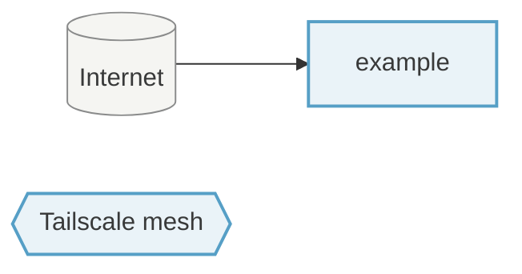

<!-- SPDX-FileCopyrightText: Tim Sutton -->
<!-- SPDX-License-Identifier: MIT -->

FLEET

# Hosts

_This page is generated by `nix run .#docs-generate-hosts`. Do not hand-edit — your changes will be overwritten._

Each linked page below describes exactly what is deployed on a given machine: hostname, architecture, kernel, bootloader, open firewall ports, installed packages, enabled services, desktop environment, and users.

## Fleet overview

_Network topology across the Kartoza fleet — Tailscale-meshed hosts and any hosts with inbound Internet ports._

## Fleet at a glance

| Host | Role | Desktop env | Tailscale | Inbound firewall |
| --- | --- | --- | --- | --- |
| [example](example.md) | Desktop / laptop | COSMIC | — | 2 ports |
