<!-- SPDX-FileCopyrightText: Tim Sutton -->
<!-- SPDX-License-Identifier: MIT -->

<span class="kz-eyebrow">REFERENCE</span>

# Software bundles

<!-- Generated by docs/scripts/generate-bundle-docs.py. Do not edit by hand. -->

A **bundle is a directory** under `software/`. That is the whole idea: the taxonomy and the package sets are one system rather than two descriptions of the same tree that have to be kept in step.

```text
software/desktop/browsers/
  bundle.json      what it is, what it needs, what is in it
  browsers.nix     the module
```

A host names the bundles it wants and gets those, plus anything they imply, transitively:

```nix
# hosts/<name>/config.nix
bundles = [
  "desktop-browsers"
  "desktop-productivity"
];
```

A bundle's name is its path with slashes turned into hyphens, so the name always says where to look for it.

## Turning bundles on and off

`gisnix configure` is the menu. It reads the registry — every `bundle.json` under `software/` — and *not* the host's current `config.nix`, so the list you tick is always complete. A bundle added this morning is on the menu this afternoon, whether or not any host has heard of it.

```bash
gisnix configure                      # this machine, then tick the bundles
gisnix configure myhost               # straight to myhost's bundles
gisnix configure myhost --list        # what it takes today; changes nothing
gisnix configure myhost --enable desktop-gis
gisnix configure myhost --disable terminal-ai,desktop-games
gisnix configure myhost --set base,desktop-browsers --locale za-en
gisnix configure myhost --kernel latest
gisnix configure myhost --enable security --dry-run
```

### The chooser

Three panes. Bundles on the left, what the highlighted bundle installs on the right, and detail along the bottom:

```text
┌──────────────────┬──────────────────────────────┐
│ bundles          │ what this bundle installs      │
│ ● base           │   • firefox                    │
│ ○ desktop-gis    │   • brave                      │
├──────────────────┴──────────────────────────────┤
│ detail of whatever is highlighted                 │
└─────────────────────────────────────────────────┘
```

| Key | |
| --- | --- |
| <kbd>/</kbd> | filter both panes. Matches a bundle's name, any package in it, or any of its module filenames — so typing `firefox` answers *which bundle would install that?* Enter keeps the filter, escape clears it |
| <kbd>tab</kbd> | move between the two upper panes. The bottom pane follows whichever has focus: the bundle on the left, the individual package on the right |
| <kbd>space</kbd> | take or drop the highlighted bundle |
| <kbd>g</kbd> | the bundle together with everything nested in it |
| <kbd>e</kbd> | edit mode: change what the bundles *contain* |
| <kbd>ctrl</kbd>+<kbd>s</kbd> | done — go on to the diff |
| <kbd>esc</kbd> | cancel, writing nothing |

Package descriptions in the bottom pane come from `docs/references/software.json`, which `docs/scripts/generate-software-catalogue.py` writes out of nixpkgs metadata. That generator runs a `nix eval` over every host and takes minutes; a pane redrawing on every keypress has milliseconds, so it reads the answer that run already worked out. A package no host installs is not in the index and is labelled as such rather than shown blank.

The package lists themselves are read from the module source, which is a heuristic and says so: a package arriving by a route the reader does not follow is **missing** rather than wrong. `gisnix bundles <name>` is the authoritative view.

Nothing is written until the diff has been shown and confirmed — and never at all if the result fails `nix-instantiate --parse`.

### Bundles that cannot be removed

A bundle marked `"required": true` is one `gisnix configure` will not take away from a host that has it. Unticking it is one keystroke, the result builds perfectly well, and then the machine does not come back — which you find out at a console it no longer runs an ssh daemon on.

| Bundle | Why |
| --- | --- |
| [`base`](#base) | this is the ZFS root and its bootloader. Removing it does not make the machine smaller, it makes it unbootable |
| [`services-system`](#services-system) | sshd, CA trust and kernel hardening. Removing it from a machine you reach over the network is how you stop being able to reach it |

This is **not** the same as "every host must have it". A host that imports its software directly, bypassing the bundle list entirely, takes neither — forcing the bundle onto it would change what that machine installs, a tool protecting you from one mistake by making a different one. The rule only bites on a host that already has the bundle. `--force` overrides it.

### Groups bring their sub-bundles

Some bundles nest: `services/device/input` sits inside `services/device`. The menu shows that as a tree, and switching a group **on** switches its children on with it — choosing `services-device` means choosing the keyboards and the printer too, because that is what the directory says the group is.

Switching a group **off** takes its children with it, and that half is not optional. Every child names its parent in `implies`, so a host keeping `services-device-input` gets `services-device` whatever its `config.nix` says — dropping the parent alone changes nothing except to make the file claim something untrue. Opt-in children go too: `optIn` means *never added on your behalf*, not *never removed*, and dropping a group should not strand its parts.

| | on | off |
| --- | --- | --- |
| **its children** | come too, except `optIn` ones | all go, `optIn` included |
| **why** | taking a group means taking what is in it | a child left behind drags the parent back |

Untick a child afterwards if you want the group without it — the chooser's answer is written as-is, so it sticks. `--no-cascade` turns off the *on* half; the *off* half always applies, because its absence produces a file that lies.

The chooser shows a third state for this: a bundle you did not pick but which arrives anyway is drawn `◐ … via desktop-gis` rather than as switched off.

#### Bundles that refuse to be taken this way

A bundle marked `"optIn": true` is **never** selected on a host's behalf. It has to be asked for by name. Two carry the mark, and `gisnix configure` says so rather than staying quiet about what it declined to add:

| Bundle | Why |
| --- | --- |
| [`desktop-gis-source-builds`](#desktop-gis-source-builds) | hours of build time; the binary channels already cover normal use |
| [`desktop-environments-cosmic-extensions`](#desktop-environments-cosmic-extensions) | every one of these source builds. They are community cosmic-utils packages, in neither cache.nixos.org nor cosmic.cachix.org — expect a slow rebuild the first time you enable this bundle, not a hang |
| [`desktop-gis-versions-qgis-1-8`](#desktop-gis-versions-qgis-1-8) | a frozen historical QGIS; take it only when a project needs this exact series |
| [`desktop-gis-versions-qgis-2-10`](#desktop-gis-versions-qgis-2-10) | a frozen historical QGIS; take it only when a project needs this exact series |
| [`desktop-gis-versions-qgis-2-16`](#desktop-gis-versions-qgis-2-16) | a frozen historical QGIS; take it only when a project needs this exact series |
| [`desktop-gis-versions-qgis-2-18`](#desktop-gis-versions-qgis-2-18) | a frozen historical QGIS; take it only when a project needs this exact series |
| [`desktop-gis-versions-qgis-2-4`](#desktop-gis-versions-qgis-2-4) | a frozen historical QGIS; take it only when a project needs this exact series |
| [`desktop-gis-versions-qgis-2-6`](#desktop-gis-versions-qgis-2-6) | a frozen historical QGIS; take it only when a project needs this exact series |
| [`desktop-gis-versions-qgis-2-8`](#desktop-gis-versions-qgis-2-8) | a frozen historical QGIS; take it only when a project needs this exact series |
| [`desktop-gis-versions-qgis-3-10`](#desktop-gis-versions-qgis-3-10) | a frozen historical QGIS; take it only when a project needs this exact series |
| [`desktop-gis-versions-qgis-3-16`](#desktop-gis-versions-qgis-3-16) | a frozen historical QGIS; take it only when a project needs this exact series |
| [`desktop-gis-versions-qgis-3-22`](#desktop-gis-versions-qgis-3-22) | a frozen historical QGIS; take it only when a project needs this exact series |
| [`desktop-gis-versions-qgis-3-24`](#desktop-gis-versions-qgis-3-24) | a frozen historical QGIS; take it only when a project needs this exact series |
| [`desktop-gis-versions-qgis-3-26`](#desktop-gis-versions-qgis-3-26) | a frozen historical QGIS; take it only when a project needs this exact series |
| [`desktop-gis-versions-qgis-3-28`](#desktop-gis-versions-qgis-3-28) | a frozen historical QGIS; take it only when a project needs this exact series |
| [`desktop-gis-versions-qgis-3-32`](#desktop-gis-versions-qgis-3-32) | a frozen historical QGIS; take it only when a project needs this exact series |
| [`desktop-gis-versions-qgis-3-34`](#desktop-gis-versions-qgis-3-34) | a frozen historical QGIS; take it only when a project needs this exact series |
| [`desktop-gis-versions-qgis-3-36`](#desktop-gis-versions-qgis-3-36) | a frozen historical QGIS; take it only when a project needs this exact series |
| [`desktop-gis-versions-qgis-3-38`](#desktop-gis-versions-qgis-3-38) | a frozen historical QGIS; take it only when a project needs this exact series |
| [`desktop-gis-versions-qgis-3-4`](#desktop-gis-versions-qgis-3-4) | a frozen historical QGIS; take it only when a project needs this exact series |
| [`desktop-gis-versions-qgis-3-40`](#desktop-gis-versions-qgis-3-40) | a frozen historical QGIS; take it only when a project needs this exact series |
| [`desktop-gis-versions-qgis-3-42`](#desktop-gis-versions-qgis-3-42) | a frozen historical QGIS; take it only when a project needs this exact series |
| [`desktop-gis-versions-qgis-3-44`](#desktop-gis-versions-qgis-3-44) | a frozen historical QGIS; take it only when a project needs this exact series |
| [`desktop-gis-versions-qgis-3-8`](#desktop-gis-versions-qgis-3-8) | a frozen historical QGIS; take it only when a project needs this exact series |
| [`desktop-gis-versions-qgis-4-0`](#desktop-gis-versions-qgis-4-0) | a frozen historical QGIS; take it only when a project needs this exact series |
| [`services-device-peripherals`](#services-device-peripherals) | biometrics can affect whether you can log in, and the rest are daemons for hardware most hosts do not have |

```bash
gisnix configure myhost --enable services-device-peripherals
```

### Edit mode

<kbd>e</kbd> switches the chooser from *which bundles this host takes* to *what those bundles contain*. In edit mode:

| Key | |
| --- | --- |
| <kbd>d</kbd> | delete the highlighted package from its module |
| <kbd>a</kbd> | add a package, completing from the catalogue |
| <kbd>g</kbd> | create a new bundle, or a sub-bundle |

!!! warning "These edits are not about one host"

    Everything above rewrites a module under `software/`, so it changes **every host whose bundles include it** — up to nine at once. The chooser says how many before staging each edit, and the diff at the end is shown per file with the affected hosts listed beside it.

Nothing reaches disk while you work: edits are staged and written only on <kbd>ctrl</kbd>+<kbd>s</kbd>, after the diff. Each one is then composed in memory, checked with `nix-instantiate --parse` and read back to confirm it says what was asked, before the file is replaced atomically. A refusal partway leaves the module untouched.

The rules the editor works to:

- an edit is located by **parsing**, never by searching for a string. `firefox` occurs in comments, in embedded shell scripts and in URLs, and deleting the wrong one yields a module that still evaluates and quietly installs the wrong software
- a package is removed only when it sits **alone on its line**. The repository writes one package per line throughout, so this covers everything that exists; where it does not hold the editor refuses and says why rather than reaching into a line it does not follow
- an added package is checked against nixpkgs with `nix eval` first. A typo would otherwise give every host taking the bundle an evaluation error, discovered at the next rebuild rather than here
- some packages are **load-bearing** and cannot be removed at all, listed as `requiredPackages` in the owning `bundle.json` with the reason. `fish` is somebody's login shell; `starship`, `fzf`, `zoxide`, `direnv` and `atuin` are what fish's own `interactiveShellInit` invokes, so deleting one does not break the build — it makes every shell opened afterwards print an error, on every machine, which is the kind of breakage nobody attributes to a package list
- **packages this flake defines are locked** from deletion, though the bundles holding them stay entirely optional. The Kartoza applications, the sandboxed AI tools, and the derivations a module builds in its own `let` block are all ours: removing the entry that installs one frees nothing, it just leaves the derivation built by nothing and reaching no machine. Not wanting them is done by dropping the bundle, which is a keystroke away. The list is derived from `overlays/default.nix`, so a package added there tomorrow is protected without anyone recording it anywhere. A merely *patched* nixpkgs package — `signal-desktop`, say — is not locked; it is still in nixpkgs if the entry goes
- a new bundle's **name is derived from its path**, so `desktop/audio` is `desktop-audio`; a bundle nested inside another implies its parent automatically. `git add` it — nix reads the flake from the git tree, so an untracked bundle is invisible

### It evaluates before it lets you leave

After writing, `gisnix configure` evaluates the host:

```bash
nix eval .#nixosConfigurations.<host>.config.system.build.toplevel.drvPath
```

It builds nothing — this is the same work `nixos-rebuild` does before it starts fetching. **If it fails, every file the run wrote is put back**, and the error is shown where it can still be acted on.

This is not the same check as parsing, and the difference matters. `nix-instantiate --parse` cannot know that a bundle pulls in an unfree package nothing has allowed, that two modules define the same option, or that an assertion now fails. Each of those produces a file that parses perfectly and a machine that will not build.

That gap was not hypothetical: `services-device-peripherals` could not be enabled on **any** host, because `hp-scanner.nix` pulls `hplipWithPlugin` — unfree, and reported by `lib.getName` as `hplip`, which nothing allowed. Every file parsed. The failure surfaced at `nixos-rebuild`, after the configuration had been written. `--no-eval` skips the check.

### What it guarantees

| | |
| --- | --- |
| **No unknown names** | the selection is checked against the registry before anything is rendered. An unknown bundle is an evaluation error, not a no-op. |
| **No duplicates, one order** | the block is rendered from a set, in the registry's own order, so toggling one bundle is a one-line diff whatever state the file arrived in. |
| **Every bundle stated** | the block lists all of them, taken or commented out under its own description. The file *is* the menu, so uncommenting a line by hand remains a complete workflow. |
| **Your notes kept** | a comment you wrote about *this machine* comes back attached to the bundle it annotated. A comment that merely repeats the registry is dropped, because it is regenerated. |
| **Nothing else touched** | everything outside `bundles = [ … ];` is copied through byte for byte. |

After editing, apply it — one bundle per rebuild is the safe way to add several, because a build that fails then names its own cause:

```bash
gisnix update myhost
```

The read-only half of the pair is `gisnix bundles`, which shows what each one contains without offering to change anything.

## Why membership is listed rather than implied

`bundle.json` names its modules explicitly. "Every `.nix` in the directory" would be simpler and wrong: `software/desktop/gis/` carries several QGIS channels that are alternatives rather than companions, and importing a directory wholesale would install every one of them at once.

Anything in a directory that no bundle claims must be listed as `unclaimed` — a stated decision rather than an oversight. `utils/check-bundles.py` fails otherwise, because a module nobody claims is a module nobody installs, and nothing would say so.

That check earns its keep. Adopting two long-unclaimed modules during this work found one that was a package derivation filed as a NixOS module, and another pinned to a placeholder checksum it could never have built from. Neither had ever worked. **A module nothing imports is not dormant, it is unverified.**

## Choices

A bundle marked `"selection": "one-of"` holds alternatives, not a set. A host names the single member it wants instead of taking the group — `software/locale/` is the clear case, since a machine has one locale and not eight.

Each group appears in the `gisnix configure` tree as radio rows nested under the bundle whose directory contains them — the two kernel rows sit under `base`, because `software/base/kernel/` is inside `software/base/`. Picking one unpicks its sibling. What gets written is the scalar key, not an entry in `bundles`.

### Kernel

`software/base/kernel/` is the second choice group, and the one with teeth:

| `kernel` | Kernel | OpenZFS | Built where |
|---|---|---|---|
| `"stable"` *(default)* | the NixOS default | from the pinned nixpkgs | prebuilt on Hydra |
| `"latest"` | 7.2, from `nixpkgs-master` | 2.4.4, from the same set | **compiled on the host** |

Every host here boots from an encrypted ZFS root, so the kernel and the ZFS package have to come from the same package set: NixOS resolves the module as `boot.kernelPackages.${boot.zfs.package.kernelModuleAttribute}`, and a kernel whose ZFS module does not build gives you a machine that cannot import its own pool. `"stable"` gets that guarantee for free — nixpkgs marks incompatible pairs broken at evaluation.

`"latest"` needs OpenZFS 2.4.4, which is the first release supporting the 7.x series and is still master-only; the pinned nixpkgs ships 2.4.3, whose ceiling is kernel 7.0. Taking the kernel from master without also taking master's ZFS reintroduces exactly the pair that does not build.

A host that pins `boot.kernelPackages` in its own `hardware.nix` cannot take `"latest"`: the pin beats the bundle and only the ZFS half moves, which is the mismatch the whole arrangement exists to prevent. The bundle asserts against this and says so by name — drop the pin, or stay on `"stable"`. Most fleets do exactly that: pin a known-good series and leave `"latest"` for the one host tracking master on purpose.

The cost is real: master is pre-Hydra, so a host choosing `"latest"` compiles both the kernel and the ZFS module itself, and again whenever the master pin moves. Rollback is the previous generation in GRUB, which carries its own matching pair.

## How they fit together

Every arrow is an `implies` edge read from `bundle.json`: the bundle at the tail brings the one at the head with it, so a host naming only the tail gets both. Nothing here is drawn by hand — this is the same graph `gisnix bundles --tree` prints in the terminal.

```mermaid
graph LR
  desktop_browsers["desktop-browsers"]
  desktop_environments_cosmic["desktop-environments-cosmic"]
  desktop_comms["desktop-comms"]
  desktop_ebook_readers["desktop-ebook-readers"]
  desktop_games["desktop-games"]
  desktop_gis["desktop-gis"]
  desktop_kartoza_apps["desktop-kartoza-apps"]
  desktop_multimedia["desktop-multimedia"]
  desktop_productivity["desktop-productivity"]
  desktop_remote["desktop-remote"]
  desktop_essentials["desktop-essentials"]
  desktop_essentials_extras["desktop-essentials-extras"]
  desktop_gis_source_builds["desktop-gis-source-builds<br/><i>opt-in</i>"]
  desktop_environments_cosmic_extensions["desktop-environments-cosmic-extensions<br/><i>opt-in</i>"]
  desktop_gis_versions_qgis_1_8["desktop-gis-versions-qgis-1-8<br/><i>opt-in</i>"]
  desktop_gis_versions_qgis_2_10["desktop-gis-versions-qgis-2-10<br/><i>opt-in</i>"]
  desktop_gis_versions_qgis_2_16["desktop-gis-versions-qgis-2-16<br/><i>opt-in</i>"]
  desktop_gis_versions_qgis_2_18["desktop-gis-versions-qgis-2-18<br/><i>opt-in</i>"]
  desktop_gis_versions_qgis_2_4["desktop-gis-versions-qgis-2-4<br/><i>opt-in</i>"]
  desktop_gis_versions_qgis_2_6["desktop-gis-versions-qgis-2-6<br/><i>opt-in</i>"]
  desktop_gis_versions_qgis_2_8["desktop-gis-versions-qgis-2-8<br/><i>opt-in</i>"]
  desktop_gis_versions_qgis_3_10["desktop-gis-versions-qgis-3-10<br/><i>opt-in</i>"]
  desktop_gis_versions_qgis_3_16["desktop-gis-versions-qgis-3-16<br/><i>opt-in</i>"]
  desktop_gis_versions_qgis_3_22["desktop-gis-versions-qgis-3-22<br/><i>opt-in</i>"]
  desktop_gis_versions_qgis_3_24["desktop-gis-versions-qgis-3-24<br/><i>opt-in</i>"]
  desktop_gis_versions_qgis_3_26["desktop-gis-versions-qgis-3-26<br/><i>opt-in</i>"]
  desktop_gis_versions_qgis_3_28["desktop-gis-versions-qgis-3-28<br/><i>opt-in</i>"]
  desktop_gis_versions_qgis_3_32["desktop-gis-versions-qgis-3-32<br/><i>opt-in</i>"]
  desktop_gis_versions_qgis_3_34["desktop-gis-versions-qgis-3-34<br/><i>opt-in</i>"]
  desktop_gis_versions_qgis_3_36["desktop-gis-versions-qgis-3-36<br/><i>opt-in</i>"]
  desktop_gis_versions_qgis_3_38["desktop-gis-versions-qgis-3-38<br/><i>opt-in</i>"]
  desktop_gis_versions_qgis_3_4["desktop-gis-versions-qgis-3-4<br/><i>opt-in</i>"]
  desktop_gis_versions_qgis_3_40["desktop-gis-versions-qgis-3-40<br/><i>opt-in</i>"]
  desktop_gis_versions_qgis_3_42["desktop-gis-versions-qgis-3-42<br/><i>opt-in</i>"]
  desktop_gis_versions_qgis_3_44["desktop-gis-versions-qgis-3-44<br/><i>opt-in</i>"]
  desktop_gis_versions_qgis_3_8["desktop-gis-versions-qgis-3-8<br/><i>opt-in</i>"]
  desktop_gis_versions_qgis_4_0["desktop-gis-versions-qgis-4-0<br/><i>opt-in</i>"]
  services_device_input["services-device-input"]
  services_device["services-device"]
  services_device_input_kanata["services-device-input-kanata"]
  services_device_mobile["services-device-mobile"]
  services_device_peripherals["services-device-peripherals<br/><i>opt-in</i>"]
  services_device_printing["services-device-printing"]
  services_system_console["services-system-console"]
  services_system["services-system<br/><i>required</i>"]
  services_system_power["services-system-power"]
  services_system_storage["services-system-storage"]
  desktop_browsers --> desktop_environments_cosmic
  desktop_comms --> desktop_environments_cosmic
  desktop_ebook_readers --> desktop_environments_cosmic
  desktop_games --> desktop_environments_cosmic
  desktop_gis --> desktop_environments_cosmic
  desktop_kartoza_apps --> desktop_environments_cosmic
  desktop_multimedia --> desktop_environments_cosmic
  desktop_productivity --> desktop_environments_cosmic
  desktop_remote --> desktop_environments_cosmic
  desktop_environments_cosmic --> desktop_essentials
  desktop_essentials_extras --> desktop_essentials
  desktop_gis_source_builds --> desktop_gis
  desktop_environments_cosmic_extensions --> desktop_environments_cosmic
  desktop_gis_versions_qgis_1_8 --> desktop_gis
  desktop_gis_versions_qgis_2_10 --> desktop_gis
  desktop_gis_versions_qgis_2_16 --> desktop_gis
  desktop_gis_versions_qgis_2_18 --> desktop_gis
  desktop_gis_versions_qgis_2_4 --> desktop_gis
  desktop_gis_versions_qgis_2_6 --> desktop_gis
  desktop_gis_versions_qgis_2_8 --> desktop_gis
  desktop_gis_versions_qgis_3_10 --> desktop_gis
  desktop_gis_versions_qgis_3_16 --> desktop_gis
  desktop_gis_versions_qgis_3_22 --> desktop_gis
  desktop_gis_versions_qgis_3_24 --> desktop_gis
  desktop_gis_versions_qgis_3_26 --> desktop_gis
  desktop_gis_versions_qgis_3_28 --> desktop_gis
  desktop_gis_versions_qgis_3_32 --> desktop_gis
  desktop_gis_versions_qgis_3_34 --> desktop_gis
  desktop_gis_versions_qgis_3_36 --> desktop_gis
  desktop_gis_versions_qgis_3_38 --> desktop_gis
  desktop_gis_versions_qgis_3_4 --> desktop_gis
  desktop_gis_versions_qgis_3_40 --> desktop_gis
  desktop_gis_versions_qgis_3_42 --> desktop_gis
  desktop_gis_versions_qgis_3_44 --> desktop_gis
  desktop_gis_versions_qgis_3_8 --> desktop_gis
  desktop_gis_versions_qgis_4_0 --> desktop_gis
  services_device_input --> services_device
  services_device_input_kanata --> services_device
  services_device_mobile --> services_device
  services_device_peripherals --> services_device
  services_device_printing --> services_device
  services_system_console --> services_system
  services_system_power --> services_system
  services_system_storage --> services_system
```



## The bundles

| Bundle | Modules | Requires | Pulled in by |
| --- | --- | --- | --- |
| [`base`](#base)  | 9 | — | — |
| [`base-kernel`](#base-kernel)  *(choice)* | 2 | — | — |
| [`terminal-ai`](#terminal-ai)  | 4 | — | — |
| [`terminal-chat`](#terminal-chat)  | 1 | — | — |
| [`terminal-editor`](#terminal-editor)  | 1 | — | — |
| [`terminal-tuis`](#terminal-tuis)  | 9 | — | — |
| [`desktop-browsers`](#desktop-browsers)  | 1 | `desktop-environments-cosmic` | — |
| [`desktop-comms`](#desktop-comms)  | 3 | `desktop-environments-cosmic` | — |
| [`desktop-ebook-readers`](#desktop-ebook-readers)  | 4 | `desktop-environments-cosmic` | — |
| [`desktop-essentials`](#desktop-essentials)  | 1 | — | `desktop-environments-cosmic`, `desktop-essentials-extras` |
| [`desktop-games`](#desktop-games)  | 3 | `desktop-environments-cosmic` | — |
| [`desktop-gis`](#desktop-gis)  | 8 | `desktop-environments-cosmic` | `desktop-gis-source-builds`, `desktop-gis-versions-qgis-1-8`, `desktop-gis-versions-qgis-2-10`, `desktop-gis-versions-qgis-2-16`, `desktop-gis-versions-qgis-2-18`, `desktop-gis-versions-qgis-2-4`, `desktop-gis-versions-qgis-2-6`, `desktop-gis-versions-qgis-2-8`, `desktop-gis-versions-qgis-3-10`, `desktop-gis-versions-qgis-3-16`, `desktop-gis-versions-qgis-3-22`, `desktop-gis-versions-qgis-3-24`, `desktop-gis-versions-qgis-3-26`, `desktop-gis-versions-qgis-3-28`, `desktop-gis-versions-qgis-3-32`, `desktop-gis-versions-qgis-3-34`, `desktop-gis-versions-qgis-3-36`, `desktop-gis-versions-qgis-3-38`, `desktop-gis-versions-qgis-3-4`, `desktop-gis-versions-qgis-3-40`, `desktop-gis-versions-qgis-3-42`, `desktop-gis-versions-qgis-3-44`, `desktop-gis-versions-qgis-3-8`, `desktop-gis-versions-qgis-4-0` |
| [`desktop-kartoza-apps`](#desktop-kartoza-apps)  | 1 | `desktop-environments-cosmic` | — |
| [`desktop-multimedia`](#desktop-multimedia)  | 4 | `desktop-environments-cosmic` | — |
| [`desktop-productivity`](#desktop-productivity)  | 3 | `desktop-environments-cosmic` | — |
| [`desktop-remote`](#desktop-remote)  | 3 | `desktop-environments-cosmic` | — |
| [`desktop-environments-cosmic`](#desktop-environments-cosmic)  | 3 | `desktop-essentials` | `desktop-browsers`, `desktop-comms`, `desktop-ebook-readers`, `desktop-environments-cosmic-extensions`, `desktop-games`, `desktop-gis`, `desktop-kartoza-apps`, `desktop-multimedia`, `desktop-productivity`, `desktop-remote` |
| [`desktop-essentials-extras`](#desktop-essentials-extras)  | 1 | `desktop-essentials` | — |
| [`desktop-gis-source-builds`](#desktop-gis-source-builds)  | 3 | `desktop-gis` | — |
| [`desktop-environments-cosmic-extensions`](#desktop-environments-cosmic-extensions)  | 1 | `desktop-environments-cosmic` | — |
| [`desktop-gis-versions-qgis-1-8`](#desktop-gis-versions-qgis-1-8)  | 1 | `desktop-gis` | — |
| [`desktop-gis-versions-qgis-2-10`](#desktop-gis-versions-qgis-2-10)  | 1 | `desktop-gis` | — |
| [`desktop-gis-versions-qgis-2-16`](#desktop-gis-versions-qgis-2-16)  | 1 | `desktop-gis` | — |
| [`desktop-gis-versions-qgis-2-18`](#desktop-gis-versions-qgis-2-18)  | 1 | `desktop-gis` | — |
| [`desktop-gis-versions-qgis-2-4`](#desktop-gis-versions-qgis-2-4)  | 1 | `desktop-gis` | — |
| [`desktop-gis-versions-qgis-2-6`](#desktop-gis-versions-qgis-2-6)  | 1 | `desktop-gis` | — |
| [`desktop-gis-versions-qgis-2-8`](#desktop-gis-versions-qgis-2-8)  | 1 | `desktop-gis` | — |
| [`desktop-gis-versions-qgis-3-10`](#desktop-gis-versions-qgis-3-10)  | 1 | `desktop-gis` | — |
| [`desktop-gis-versions-qgis-3-16`](#desktop-gis-versions-qgis-3-16)  | 1 | `desktop-gis` | — |
| [`desktop-gis-versions-qgis-3-22`](#desktop-gis-versions-qgis-3-22)  | 1 | `desktop-gis` | — |
| [`desktop-gis-versions-qgis-3-24`](#desktop-gis-versions-qgis-3-24)  | 1 | `desktop-gis` | — |
| [`desktop-gis-versions-qgis-3-26`](#desktop-gis-versions-qgis-3-26)  | 1 | `desktop-gis` | — |
| [`desktop-gis-versions-qgis-3-28`](#desktop-gis-versions-qgis-3-28)  | 1 | `desktop-gis` | — |
| [`desktop-gis-versions-qgis-3-32`](#desktop-gis-versions-qgis-3-32)  | 1 | `desktop-gis` | — |
| [`desktop-gis-versions-qgis-3-34`](#desktop-gis-versions-qgis-3-34)  | 1 | `desktop-gis` | — |
| [`desktop-gis-versions-qgis-3-36`](#desktop-gis-versions-qgis-3-36)  | 1 | `desktop-gis` | — |
| [`desktop-gis-versions-qgis-3-38`](#desktop-gis-versions-qgis-3-38)  | 1 | `desktop-gis` | — |
| [`desktop-gis-versions-qgis-3-4`](#desktop-gis-versions-qgis-3-4)  | 1 | `desktop-gis` | — |
| [`desktop-gis-versions-qgis-3-40`](#desktop-gis-versions-qgis-3-40)  | 1 | `desktop-gis` | — |
| [`desktop-gis-versions-qgis-3-42`](#desktop-gis-versions-qgis-3-42)  | 1 | `desktop-gis` | — |
| [`desktop-gis-versions-qgis-3-44`](#desktop-gis-versions-qgis-3-44)  | 1 | `desktop-gis` | — |
| [`desktop-gis-versions-qgis-3-8`](#desktop-gis-versions-qgis-3-8)  | 1 | `desktop-gis` | — |
| [`desktop-gis-versions-qgis-4-0`](#desktop-gis-versions-qgis-4-0)  | 1 | `desktop-gis` | — |
| [`services-device`](#services-device)  | 2 | — | `services-device-input`, `services-device-input-kanata`, `services-device-mobile`, `services-device-peripherals`, `services-device-printing` |
| [`services-dns`](#services-dns)  | 2 | — | — |
| [`services-network`](#services-network)  | 2 | — | — |
| [`services-sync`](#services-sync)  | 2 | — | — |
| [`services-system`](#services-system)  | 8 | — | `services-system-console`, `services-system-power`, `services-system-storage` |
| [`services-virtualisation`](#services-virtualisation)  | 4 | — | — |
| [`services-device-input`](#services-device-input)  | 4 | `services-device` | — |
| [`services-device-input-kanata`](#services-device-input-kanata)  | 2 | `services-device` | — |
| [`services-device-mobile`](#services-device-mobile)  | 2 | `services-device` | — |
| [`services-device-peripherals`](#services-device-peripherals)  | 4 | `services-device` | — |
| [`services-device-printing`](#services-device-printing)  | 1 | `services-device` | — |
| [`services-system-boot-themes`](#services-system-boot-themes)  *(choice)* | 6 | — | — |
| [`services-system-console`](#services-system-console)  | 4 | `services-system` | — |
| [`services-system-power`](#services-system-power)  | 3 | `services-system` | — |
| [`services-system-storage`](#services-system-storage)  | 3 | `services-system` | — |
| [`security`](#security)  | 4 | — | — |
| [`locale`](#locale)  *(choice)* | 8 | — | — |

### base

*Everything a machine needs to be a usable machine: ZFS root and its bootloader, the memory guard a swapless host depends on, the login shell, the terminal emulator and the core command-line tools. A host taking only this is minimal but not crippled.*

`software/base/`

| Module | What it is |
| --- | --- |
| `fetchers.nix` | — |
| `fish.nix` | — |
| `herdr.nix` | — |
| `initrd-ssh-unlock.nix` | Remote boot-unlock — a minimal SSH server in the initrd, so a machine whose encrypted ZFS root is waiting on a… |
| `kitty.nix` | — |
| `starship.nix` | — |
| `utilities.nix` | — |
| `zfs.nix` | ZFS root: pool behaviour, the bootloader that has to understand it, and the passphrase prompt at boot |
| `zram.nix` | — |

### base-kernel

*Which kernel this machine boots. Exactly one — a host takes `stable` or `latest`, never both. Every host here boots an encrypted ZFS root, so the kernel and the OpenZFS module must come from the same package set; each member below pairs them itself.*

`software/base/kernel/`

> **A choice, not a set.** A host takes exactly one of these.

| Module | What it is |
| --- | --- |
| `kernel-stable.nix` | Stable kernel: whatever the pinned nixpkgs calls default |
| `kernel-latest.nix` | Latest kernel: 7.2, with the OpenZFS that supports it, both from nixpkgs-master |

### terminal-ai

*AI assistants, each bubblewrap-sandboxed so a compromised one cannot reach your SSH agent. Opt-in: local-llm alone pulls the ROCm stack into the closure.*

`software/terminal/ai/`

- `antigravity.nix`
- `claude-code.nix`
- `gemini-cli.nix`
- `local-llm.nix`

### terminal-chat

*Terminal chat and forum clients: discourse-tui, tut, perch, siggy — Discourse, Mastodon, Bluesky and Signal. Its own bundle, a sibling to terminal-tuis rather than a file inside it, so it shows up as its own selectable group and installs all four the moment a host takes it — no host wants any of them by default, but a host that takes this bundle wants what it names. To keep only some: programs.terminal-chat.enableAll = false; plus the specific programs.terminal-chat.apps.<id>.enable = true; lines.*

`software/terminal/chat/`

| Module | What it is |
| --- | --- |
| `chat.nix` | Terminal chat and forum clients — full-screen apps for talking to people without leaving the terminal, distinct from… |

### terminal-editor

*Neovim, configured through nvf, with the EDITOR and vim/vi wiring that goes with it. Its own bundle rather than part of terminal-tuis because the plugin set builds from source — a crates.io fetch that has failed on hosts whose store cannot reach this flake's inputs, and the reason a host behind such a store takes the rest of the TUIs without it.*

`software/terminal/editor/`

| Module | What it is |
| --- | --- |
| `vim.nix` | Vim configuration using timvim neovim distribution |

### terminal-tuis

*Full-screen terminal applications: yazi and Midnight Commander for files, lazygit for git, aerc for mail, btop and friends for watching the machine, khal and khard for calendars and contacts. nmtui is not here because it is not a package — it ships inside networkmanager, which services-network enables. Chat/forum TUIs (Discourse, Mastodon, Bluesky, Signal) are the terminal-chat bundle, a sibling of this one.*

`software/terminal/tuis/`

| Module | What it is |
| --- | --- |
| `calendar.nix` | Calendar and scheduling applications |
| `fastfetch.nix` | — |
| `files.nix` | File and disk browsers |
| `lazygit.nix` | — |
| `mail.nix` | Terminal mail |
| `monitors.nix` | System monitors |
| `ns.nix` | — |
| `tools.nix` | Full-screen tools that are not an editor, a file manager or a monitor |
| `yazi.nix` | — |

### desktop-browsers

*Web browsers.*

`software/desktop/browsers/`

Taking this also brings in `desktop-environments-cosmic`.

| Module | What it is |
| --- | --- |
| `browsers.nix` | Web browsers |

### desktop-comms

*Talking to people and moving files between machines you own.*

`software/desktop/comms/`

Taking this also brings in `desktop-environments-cosmic`.

| Module | What it is |
| --- | --- |
| `localsend.nix` | — |
| `signal.nix` | Signal Desktop — messaging app |
| `social.nix` | Social and messaging clients that are not Signal |

### desktop-ebook-readers

*E-book readers and library management.*

`software/desktop/ebook-readers/`

Taking this also brings in `desktop-environments-cosmic`.

| Module | What it is |
| --- | --- |
| `calibre.nix` | — |
| `foliate.nix` | — |
| `koodo-reader.nix` | Koodo Reader — cross-platform e-book reader with library management |
| `thorium-reader.nix` | Thorium Reader — EPUB, PDF and audiobook reader from EDRLab, with strong accessibility support |

### desktop-essentials

*Desktop-environment-agnostic pieces every graphical session needs: fonts, file manager, clipboard, notifications, document viewers, screen capture.*

`software/desktop/essentials/`

| Module | What it is |
| --- | --- |
| `desktop-base.nix` | Desktop base — DE-agnostic desktop pieces that are NOT COSMIC-repo packages |

### desktop-games

*Games and emulators.*

`software/desktop/games/`

Taking this also brings in `desktop-environments-cosmic`.

- `games.nix`
- `retroarch.nix`
- `steam.nix`

### desktop-gis

*QGIS and the geospatial desktop, on the packaged binary channels. Several QGIS versions install side by side deliberately — that is how a GIS workstation is used.*

`software/desktop/gis/`

Taking this also brings in `desktop-environments-cosmic`.

| Module | What it is |
| --- | --- |
| `cloudcompare.nix` | — |
| `google-earth-pro.nix` | — |
| `grass.nix` | GRASS GIS |
| `qgis-latest.nix` | — |
| `qgis-ltr.nix` | — |
| `qgis-wayland-appid.nix` | Shared desktop entry so Wayland panels (COSMIC) match QGIS windows to a proper icon |
| `saga.nix` | — |
| `whitebox-tools.nix` | — |

Present in the directory but deliberately not installed: `qgis-pinned.nix`, `qgis-python-extras.nix`, `wrap-qgis.nix`.

### desktop-kartoza-apps

*Endpoint monitoring for the desktop. A downstream flake with private tooling — timesheets, screencasters, web-app launchers and the like — adds bundles of its own alongside this one; none of that belongs in gisnix.*

`software/desktop/kartoza-apps/`

Taking this also brings in `desktop-environments-cosmic`.

| Module | What it is |
| --- | --- |
| `gatus-monitor.nix` | Gatus Monitor — system-tray app for watching Gatus health-check endpoints |

### desktop-multimedia

*Audio and video creation: screen recording and streaming, and editors tracking nixpkgs-unstable.*

`software/desktop/multimedia/`

Taking this also brings in `desktop-environments-cosmic`.

| Module | What it is |
| --- | --- |
| `codecs.nix` | Codecs and image-format loaders, for everything that previews media |
| `creative-apps.nix` | Creative applications: audio, image, video and 3D authoring |
| `obs.nix` | — |
| `unstable-apps.nix` | — |

### desktop-productivity

*Getting work done: the office and creative suite, mail and calendar, and screen annotation for presentations.*

`software/desktop/productivity/`

Taking this also brings in `desktop-environments-cosmic`.

| Module | What it is |
| --- | --- |
| `email-calendar.nix` | — |
| `gromit-mpx.nix` | — |
| `gui-apps.nix` | Desktop productivity applications: documents, notes, money, diagrams |

### desktop-remote

*Screens from somewhere else: remote desktop, phone mirroring, and receiving AirPlay.*

`software/desktop/remote/`

Taking this also brings in `desktop-environments-cosmic`.

- `rustdesk.nix`
- `scrcpy.nix`
- `uxplay.nix`

### desktop-environments-cosmic

*The COSMIC desktop itself: compositor, greeter, core applications, the Kartoza App Library icon, the screenshot and GIF-recording glue, and the SSH/GPG agent wiring that goes with a graphical session. The community extensions and applets are a separate bundle, because they source build.*

`software/desktop/environments/cosmic/`

Taking this also brings in `desktop-essentials`.

| Module | What it is |
| --- | --- |
| `cosmic.nix` | COSMIC Desktop Environment — the kartoza.cosmic option and the settings that depend on it |
| `packages.nix` | COSMIC Desktop Packages Applications and utilities for the COSMIC desktop environment COSMIC packages come from… |
| `ssh-gpg.nix` | COSMIC Desktop SSH and GPG integration |

### desktop-essentials-extras

*Desktop extras beyond the minimum a COSMIC session needs: clipboard history, document/image viewers, screen recording, disk management, and standalone volume/network applets. Split out so a fast first install can skip them and add them back with `gisnix configure` once there's a GUI to do it from.*

`software/desktop/essentials/extras/`

Taking this also brings in `desktop-essentials`.

| Module | What it is |
| --- | --- |
| `desktop-base-extras.nix` | Desktop applications beyond the minimum a COSMIC session needs |

### desktop-gis-source-builds

*QGIS compiled from the git heads — master (dev), the latest release branch, and the LTR branch — for testing in-progress bug fixes before they ship. Opt-in: hours of build time on top of the binary channels.*

`software/desktop/gis/source-builds/`

Taking this also brings in `desktop-gis`.

| Module | What it is |
| --- | --- |
| `qgis-dev.nix` | For hints on how to set up python deps with QGIS see the top level README.md in this repo |
| `qgis-latest-git.nix` | NixOS module to install the latest QGIS from source from Git |
| `qgis-ltr-git.nix` | NixOS module to install the ltr QGIS from source from Git |

### desktop-environments-cosmic-extensions

*COSMIC's community extensions and panel applets: calculator, tweaks, cosmic-ctl, the weather, sysinfo, caffeine, brightness and privacy-indicator applets, and the fingerprint enrolment GUI.*

`software/desktop/environments/cosmic/extensions/`

Taking this also brings in `desktop-environments-cosmic`.

| Module | What it is |
| --- | --- |
| `extensions.nix` | COSMIC community extensions and panel applets |

### desktop-gis-versions-qgis-1-8

*QGIS 1.8 pinned (1.8.0, the last 1.8.x that nixpkgs shipped), a vintage Qt4/Python2 build with no extra python packages; may no longer evaluate or have every binary cached.*

`software/desktop/gis/versions/qgis-1-8/`

Taking this also brings in `desktop-gis`.

| Module | What it is |
| --- | --- |
| `qgis-1-8.nix` | Generated by utils/gen-qgis-versions.py from qgis-versions.json |

### desktop-gis-versions-qgis-2-10

*QGIS 2.10 pinned (2.10.1, the last 2.10.x that nixpkgs shipped), a vintage Qt4/Python2 build with no extra python packages; may no longer evaluate or have every binary cached.*

`software/desktop/gis/versions/qgis-2-10/`

Taking this also brings in `desktop-gis`.

| Module | What it is |
| --- | --- |
| `qgis-2-10.nix` | Generated by utils/gen-qgis-versions.py from qgis-versions.json |

### desktop-gis-versions-qgis-2-16

*QGIS 2.16 pinned (2.16.2, the last 2.16.x that nixpkgs shipped), a vintage Qt4/Python2 build with no extra python packages; may no longer evaluate or have every binary cached.*

`software/desktop/gis/versions/qgis-2-16/`

Taking this also brings in `desktop-gis`.

| Module | What it is |
| --- | --- |
| `qgis-2-16.nix` | Generated by utils/gen-qgis-versions.py from qgis-versions.json |

### desktop-gis-versions-qgis-2-18

*QGIS 2.18 pinned (2.18.28, the last 2.18.x that nixpkgs shipped), a vintage Qt4/Python2 build with no extra python packages; may no longer evaluate or have every binary cached.*

`software/desktop/gis/versions/qgis-2-18/`

Taking this also brings in `desktop-gis`.

| Module | What it is |
| --- | --- |
| `qgis-2-18.nix` | Generated by utils/gen-qgis-versions.py from qgis-versions.json |

### desktop-gis-versions-qgis-2-4

*QGIS 2.4 pinned (2.4.0, the last 2.4.x that nixpkgs shipped), a vintage Qt4/Python2 build with no extra python packages; may no longer evaluate or have every binary cached.*

`software/desktop/gis/versions/qgis-2-4/`

Taking this also brings in `desktop-gis`.

| Module | What it is |
| --- | --- |
| `qgis-2-4.nix` | Generated by utils/gen-qgis-versions.py from qgis-versions.json |

### desktop-gis-versions-qgis-2-6

*QGIS 2.6 pinned (2.6.1, the last 2.6.x that nixpkgs shipped), a vintage Qt4/Python2 build with no extra python packages; may no longer evaluate or have every binary cached.*

`software/desktop/gis/versions/qgis-2-6/`

Taking this also brings in `desktop-gis`.

| Module | What it is |
| --- | --- |
| `qgis-2-6.nix` | Generated by utils/gen-qgis-versions.py from qgis-versions.json |

### desktop-gis-versions-qgis-2-8

*QGIS 2.8 pinned (2.8.2, the last 2.8.x that nixpkgs shipped), a vintage Qt4/Python2 build with no extra python packages; may no longer evaluate or have every binary cached.*

`software/desktop/gis/versions/qgis-2-8/`

Taking this also brings in `desktop-gis`.

| Module | What it is |
| --- | --- |
| `qgis-2-8.nix` | Generated by utils/gen-qgis-versions.py from qgis-versions.json |

### desktop-gis-versions-qgis-3-10

*QGIS 3.10 pinned (3.10.13, the last 3.10.x that nixpkgs shipped), installed with the standard python packages from its own pinned nixpkgs — pure binary-cache hits, no source builds.*

`software/desktop/gis/versions/qgis-3-10/`

Taking this also brings in `desktop-gis`.

| Module | What it is |
| --- | --- |
| `qgis-3-10.nix` | Generated by utils/gen-qgis-versions.py from qgis-versions.json |

### desktop-gis-versions-qgis-3-16

*QGIS 3.16 pinned (3.16.14, the last 3.16.x that nixpkgs shipped), installed with the standard python packages from its own pinned nixpkgs — pure binary-cache hits, no source builds.*

`software/desktop/gis/versions/qgis-3-16/`

Taking this also brings in `desktop-gis`.

| Module | What it is |
| --- | --- |
| `qgis-3-16.nix` | Generated by utils/gen-qgis-versions.py from qgis-versions.json |

### desktop-gis-versions-qgis-3-22

*QGIS 3.22 pinned (3.22.16, the last 3.22.x that nixpkgs shipped), installed with the standard python packages from its own pinned nixpkgs — pure binary-cache hits, no source builds.*

`software/desktop/gis/versions/qgis-3-22/`

Taking this also brings in `desktop-gis`.

| Module | What it is |
| --- | --- |
| `qgis-3-22.nix` | Generated by utils/gen-qgis-versions.py from qgis-versions.json |

### desktop-gis-versions-qgis-3-24

*QGIS 3.24 pinned (3.24.2, the last 3.24.x that nixpkgs shipped), installed with the standard python packages from its own pinned nixpkgs — pure binary-cache hits, no source builds.*

`software/desktop/gis/versions/qgis-3-24/`

Taking this also brings in `desktop-gis`.

| Module | What it is |
| --- | --- |
| `qgis-3-24.nix` | Generated by utils/gen-qgis-versions.py from qgis-versions.json |

### desktop-gis-versions-qgis-3-26

*QGIS 3.26 pinned (3.26.2, the last 3.26.x that nixpkgs shipped), installed with the standard python packages from its own pinned nixpkgs — pure binary-cache hits, no source builds.*

`software/desktop/gis/versions/qgis-3-26/`

Taking this also brings in `desktop-gis`.

| Module | What it is |
| --- | --- |
| `qgis-3-26.nix` | Generated by utils/gen-qgis-versions.py from qgis-versions.json |

### desktop-gis-versions-qgis-3-28

*QGIS 3.28 pinned (3.28.15, the last 3.28.x that nixpkgs shipped), installed with the standard python packages from its own pinned nixpkgs — pure binary-cache hits, no source builds.*

`software/desktop/gis/versions/qgis-3-28/`

Taking this also brings in `desktop-gis`.

| Module | What it is |
| --- | --- |
| `qgis-3-28.nix` | Generated by utils/gen-qgis-versions.py from qgis-versions.json |

### desktop-gis-versions-qgis-3-32

*QGIS 3.32 pinned (3.32.3, the last 3.32.x that nixpkgs shipped), installed with the standard python packages from its own pinned nixpkgs — pure binary-cache hits, no source builds.*

`software/desktop/gis/versions/qgis-3-32/`

Taking this also brings in `desktop-gis`.

| Module | What it is |
| --- | --- |
| `qgis-3-32.nix` | Generated by utils/gen-qgis-versions.py from qgis-versions.json |

### desktop-gis-versions-qgis-3-34

*QGIS 3.34 pinned (3.34.15, the last 3.34.x that nixpkgs shipped), installed with the standard python packages from its own pinned nixpkgs — pure binary-cache hits, no source builds.*

`software/desktop/gis/versions/qgis-3-34/`

Taking this also brings in `desktop-gis`.

| Module | What it is |
| --- | --- |
| `qgis-3-34.nix` | Generated by utils/gen-qgis-versions.py from qgis-versions.json |

### desktop-gis-versions-qgis-3-36

*QGIS 3.36 pinned (3.36.3, the last 3.36.x that nixpkgs shipped), installed with the standard python packages from its own pinned nixpkgs — pure binary-cache hits, no source builds.*

`software/desktop/gis/versions/qgis-3-36/`

Taking this also brings in `desktop-gis`.

| Module | What it is |
| --- | --- |
| `qgis-3-36.nix` | Generated by utils/gen-qgis-versions.py from qgis-versions.json |

### desktop-gis-versions-qgis-3-38

*QGIS 3.38 pinned (3.38.3, the last 3.38.x that nixpkgs shipped), installed with the standard python packages from its own pinned nixpkgs — pure binary-cache hits, no source builds.*

`software/desktop/gis/versions/qgis-3-38/`

Taking this also brings in `desktop-gis`.

| Module | What it is |
| --- | --- |
| `qgis-3-38.nix` | Generated by utils/gen-qgis-versions.py from qgis-versions.json |

### desktop-gis-versions-qgis-3-4

*QGIS 3.4 pinned (3.4.8, the last 3.4.x that nixpkgs shipped), installed with the standard python packages from its own pinned nixpkgs — pure binary-cache hits, no source builds.*

`software/desktop/gis/versions/qgis-3-4/`

Taking this also brings in `desktop-gis`.

| Module | What it is |
| --- | --- |
| `qgis-3-4.nix` | Generated by utils/gen-qgis-versions.py from qgis-versions.json |

### desktop-gis-versions-qgis-3-40

*QGIS 3.40 pinned (3.40.15, the last 3.40.x that nixpkgs shipped), installed with the standard python packages from its own pinned nixpkgs — pure binary-cache hits, no source builds.*

`software/desktop/gis/versions/qgis-3-40/`

Taking this also brings in `desktop-gis`.

| Module | What it is |
| --- | --- |
| `qgis-3-40.nix` | Generated by utils/gen-qgis-versions.py from qgis-versions.json |

### desktop-gis-versions-qgis-3-42

*QGIS 3.42 pinned (3.42.3, the last 3.42.x that nixpkgs shipped), installed with the standard python packages from its own pinned nixpkgs — pure binary-cache hits, no source builds.*

`software/desktop/gis/versions/qgis-3-42/`

Taking this also brings in `desktop-gis`.

| Module | What it is |
| --- | --- |
| `qgis-3-42.nix` | Generated by utils/gen-qgis-versions.py from qgis-versions.json |

### desktop-gis-versions-qgis-3-44

*QGIS 3.44 pinned (3.44.12, the last 3.44.x that nixpkgs shipped), installed with the standard python packages from its own pinned nixpkgs — pure binary-cache hits, no source builds.*

`software/desktop/gis/versions/qgis-3-44/`

Taking this also brings in `desktop-gis`.

| Module | What it is |
| --- | --- |
| `qgis-3-44.nix` | Generated by utils/gen-qgis-versions.py from qgis-versions.json |

### desktop-gis-versions-qgis-3-8

*QGIS 3.8 pinned (3.8.0, the last 3.8.x that nixpkgs shipped), installed with the standard python packages from its own pinned nixpkgs — pure binary-cache hits, no source builds.*

`software/desktop/gis/versions/qgis-3-8/`

Taking this also brings in `desktop-gis`.

| Module | What it is |
| --- | --- |
| `qgis-3-8.nix` | Generated by utils/gen-qgis-versions.py from qgis-versions.json |

### desktop-gis-versions-qgis-4-0

*QGIS 4.0 pinned (4.0.3, the last 4.0.x that nixpkgs shipped), installed with the standard python packages from its own pinned nixpkgs — pure binary-cache hits, no source builds.*

`software/desktop/gis/versions/qgis-4-0/`

Taking this also brings in `desktop-gis`.

| Module | What it is |
| --- | --- |
| `qgis-4-0.nix` | Generated by utils/gen-qgis-versions.py from qgis-versions.json |

### services-device

*Hardware every machine benefits from: Bluetooth and firmware updates. Anything depending on what is actually plugged in is a sub-bundle.*

`software/services/device/`

- `bluetooth.nix`
- `fwupd.nix`

### services-dns

*DNS filtering: blocky as the local resolver, plus the firewall rules that stop applications bypassing it over DoH. Fleet-wide policy.*

`software/services/dns/`

- `block-doh.nix`
- `blocky.nix`

### services-network

*Network presence: mDNS service discovery, and the overlay VPN. Tailscale here is being replaced by NetBird.*

`software/services/network/`

- `avahi.nix`
- `tailscale.nix`

### services-sync

*File synchronisation between machines and to cloud storage.*

`software/services/sync/`

- `owncloud.nix`
- `syncthing.nix`

### services-system

*What every machine needs without exception: CA trust, the fleet's /etc/hosts, kernel hardening, sshd, the unfree allow-list, audio and Flatpak.*

`software/services/system/`

| Module | What it is |
| --- | --- |
| `ca-certificates.nix` | Trust extra CA certificates system-wide |
| `flatpak.nix` | — |
| `fleet-hosts.nix` | Generate networking.extraHosts for every machine in the fleet, identically on every machine in the fleet |
| `harden.nix` | — |
| `sound.nix` | See the NixOS manual (accessible by running ‘nixos-help’) |
| `ssh-access.nix` | Who is allowed to reach sshd — the local network and the overlay VPN, never the open internet |
| `ssh.nix` | — |
| `unfree.nix` | One unfree-package allow-list, contributed to from anywhere |

### services-virtualisation

*Running things that are not native to this machine: containers, virtual machines, cross-architecture emulation, Windows compatibility.*

`software/services/virtualisation/`

| Module | What it is |
| --- | --- |
| `docker.nix` | — |
| `emulation.nix` | Cross-architecture emulation support Enables building aarch64 packages/ISOs on x86_64 systems via QEMU binfmt |
| `virt.nix` | — |
| `wine.nix` | — |

### services-device-input

*Vendor input hardware: Dygma/Bazecor configurator, Razer RGB/DPI, generic mouse configurators. Kanata's own keyboard remapping is the services-device-input-kanata bundle instead — it needs no vendor hardware and ships on by default, unlike the daemons and kernel modules here.*

`software/services/device/input/`

Taking this also brings in `services-device`.

| Module | What it is |
| --- | --- |
| `bazecor.nix` | — |
| `console-mouse.nix` | — |
| `openrazer.nix` | — |
| `piper.nix` | Gaming-mouse configuration: DPI, polling rate, button mapping, LEDs |

### services-device-input-kanata

*Kanata keyboard remapping: home-row mods, a navigation layer, and layout-aware chords (see docs/user/keyboard.md). Generic — matches every keyboard, needs no vendor hardware. On by default; a sibling of services-device-input rather than a child of it, so this stays on when the vendor-specific tools there (Bazecor, OpenRazer, Piper) are turned off.*

`software/services/device/input-kanata/`

Taking this also brings in `services-device`.

| Module | What it is |
| --- | --- |
| `kanata-email.nix` | Where the kanata email macro gets its data — see kanata-config.nix's `emailScript` and docs/user/keyboard.md's… |
| `kanata-keyboard.nix` | Kanata keyboard remapping — the layer/mod/nav mechanism gisnix ships, generated by ./kanata-config.nix |

Present in the directory but deliberately not installed: `kanata-config.nix`.

### services-device-mobile

*Phones and tablets: iOS mounting and display control.*

`software/services/device/mobile/`

Taking this also brings in `services-device`.

- `iphone.nix`
- `screen-control.nix`

### services-device-peripherals

*Hardware only some machines have: fingerprint readers, scanners, graphics tablets, game controllers. Each pulls in daemons a host without the device has no use for — and biometrics can affect whether you can log in, which is why this is never taken by default.*

`software/services/device/peripherals/`

Taking this also brings in `services-device`.

| Module | What it is |
| --- | --- |
| `biometrics.nix` | — |
| `hp-scanner.nix` | — |
| `wacom.nix` | Wacom graphics tablet support |
| `xbox1-controller.nix` | Xbox controllers, wired or wireless-with-dongle |

### services-device-printing

*CUPS and printer drivers. Its own bundle despite holding one module: printing turned out to be the peripheral most hosts actually want, and folding it into the opt-in peripherals group silently cost five machines their printers. A singleton is the lesser problem.*

`software/services/device/printing/`

Taking this also brings in `services-device`.

- `printing.nix`

### services-system-boot-themes

*GRUB and Plymouth branding. Alternatives — a host boots with one splash, and its GRUB menu matches it. Each member is the Plymouth/GRUB pair, because a Kartoza menu handing over to a QGIS splash reads as a fault.*

`software/services/system/boot-themes/`

> **A choice, not a set.** A host takes exactly one of these.

| Module | What it is |
| --- | --- |
| `boot-theme-kartoza.nix` | Kartoza-branded boot: Plymouth splash and matching GRUB menu |
| `boot-theme-qgis.nix` | QGIS "Spatial without Compromise" boot: Plymouth splash and matching GRUB menu |
| `kartoza-plymouth-theme.nix` | — |
| `kartoza-grub-theme.nix` | — |
| `qgis-plymouth-theme.nix` | — |
| `qgis-spatial-grub-theme.nix` | — |

### services-system-console

*The text console: login banner, message of the day, and fonts that make a high-DPI TTY readable.*

`software/services/system/console/`

Taking this also brings in `services-system`.

- `issue.nix`
- `motd.nix`
- `tty-fonts-common.nix`
- `tty-fonts-kmscon.nix`

### services-system-power

*Power management: battery thresholds, suspend behaviour, SSD trim. Laptop concerns.*

`software/services/system/power/`

Taking this also brings in `services-system`.

| Module | What it is |
| --- | --- |
| `charge-limit.nix` | Stop charging the battery short of full |
| `power.nix` | — |
| `ssdtrim.nix` | — |

### services-system-storage

*Filesystem support and snapshot scheduling: NTFS for external drives, sanoid for automatic ZFS snapshots, and a manual ZFS backup TUI for offloading snapshots to an external drive.*

`software/services/system/storage/`

Taking this also brings in `services-system`.

- `ntfs.nix`
- `sanoid.nix`
- `zfs-backup.nix`

### security

*Credentials and keys: the password manager, and the hardware tokens with their udev rules and daemons. Grouped by what they are for rather than whether they are hardware.*

`software/security/`

| Module | What it is |
| --- | --- |
| `authenticator.nix` | GNOME Authenticator — TOTP and 2FA codes |
| `keepassxc.nix` | See also this video for setting up HMAC YubiKey based access <https://www.youtube.com/watch?v=ATvNK5LKpv8> |
| `trezor.nix` | — |
| `yubikey.nix` | — |

### locale

*Per-country locale, keyboard layout and timezone. A host takes exactly one, named as `locale = "pt-en";`.*

`software/locale/`

> **A choice, not a set.** A host takes exactly one of these.

| Module | What it is |
| --- | --- |
| `locale-ba-en.nix` | — |
| `locale-eu-en-bosnia.nix` | — |
| `locale-eu-en-madagascar.nix` | — |
| `locale-in-en.nix` | India — English working locale |
| `locale-ke-en.nix` | — |
| `locale-pt-en.nix` | — |
| `locale-pt.nix` | — |
| `locale-za-en.nix` | — |

---

60 bundles, 149 modules.

Made with love by [Kartoza](https://kartoza.com) | [Donate](https://github.com/sponsors/timlinux) | [GitHub](https://github.com/kartoza/gisnix)
