<!-- SPDX-FileCopyrightText: Tim Sutton -->
<!-- SPDX-License-Identifier: MIT -->

<span class="kz-eyebrow">REFERENCE</span>

# Operator commands

<!-- Generated by docs/scripts/generate-commands-docs.py. Do not edit by hand. -->

Every command this flake provides. One row in `utils/commands.json` mints all of the following, so a command is declared once and cannot drift between them:

| Surface | How you reach it |
| --- | --- |
| The dev shell | `gisnix <name>` |
| Nix, from anywhere | `nix run .#<name>` |
| Directly | `./utils/<file>` |
| Neovim | `<leader>p<key>` |
| The terminal cheat-sheet | `gisnix` with no arguments |

This page is the sixth, generated from the same row.

**33 implemented**, 5 declared but not yet written. Commands still to be built are listed rather than hidden: the manifest describes the intended lifecycle, not only the part of it that exists.

## The life of a host

The `host` group in the order it is meant to be used, read straight from `utils/commands.json`. Commands that destroy something are outlined heavily; ones not yet written say so.

```mermaid
graph LR
  create_host["create-host"]
  update["update"]
  create_host --> update
  update_all["update-all"]
  update --> update_all
  inventory["inventory"]
  update_all --> inventory
  preflight["preflight"]
  inventory --> preflight
  generate_hardware["generate-hardware"]
  preflight --> generate_hardware
  deploy["deploy<br/>destroys data"]
  generate_hardware --> deploy
  install["install"]
  deploy --> install
  check["check"]
  install --> check
  installer["installer"]
  check --> installer
  suspend["suspend"]
  installer --> suspend
  wake["wake"]
  suspend --> wake
  snapshot["snapshot"]
  wake --> snapshot
  backup["backup<br/><i>planned</i>"]
  snapshot --> backup
  reset["reset<br/><i>planned</i><br/>destroys data"]
  backup --> reset
  style deploy stroke-width:3px
  style reset stroke-width:3px
```



## At a glance

**🖥 host** — Bringing a machine into the fleet, and keeping it current.

| Command | Key | What it does |
| --- | --- | --- |
| [`create-host`](#create-host) | `<leader>pa` | adopt this machine as a new host |
| [`update`](#update) | `<leader>pu` | rebuild a host (local, ssh or rsync) |
| [`update-all`](#update-all) | `<leader>pU` | rebuild the whole fleet |
| [`inventory`](#inventory) | `<leader>pi` | fleet overview, read-only |
| [`preflight`](#preflight) | `<leader>pf` | pre-rebuild safety checks |
| [`generate-hardware`](#generate-hardware) | `<leader>pg` | nixos-generate-config -> hardware.nix |
| [`deploy`](#deploy) | `<leader>pd` | create a cloud server and install |
| [`install`](#install) | `<leader>pI` | install onto a live-booted machine |
| [`check`](#check) | `<leader>pk` | deep single-host report |
| [`installer`](#installer) | `<leader>pM` | run the bootable-USB installer wizard |
| [`suspend`](#suspend) | `<leader>pz` | suspend a host |
| [`wake`](#wake) | `<leader>pw` | wake-on-LAN a host |
| [`snapshot`](#snapshot) | `<leader>pn` | manual ZFS snapshot |
| [`backup`](#backup) *(planned)* | `<leader>pb` | offload snapshots to USB |
| [`reset`](#reset) *(planned)* | `<leader>pX` | wipe and reinstall a host |

**🔐 secrets** — Age-encrypted secrets, and the keys that open them.

| Command | Key | What it does |
| --- | --- | --- |
| [`secrets`](#secrets) | `<leader>ps` | list secrets and their readers |
| [`provision-secrets`](#provision-secrets) *(planned)* | `<leader>pp` | push the age key, rekey |
| [`unlock`](#unlock) | `<leader>py` | unlock a host at initrd |
| [`add-site-deploy-key`](#add-site-deploy-key) *(planned)* | `<leader>pY` | mint and register a deploy key |
| [`netbird-provision`](#netbird-provision) *(planned)* | `<leader>pN` | enrol a host in the overlay |

**⚙ env** — Switching this checkout between development and production behaviour.

| Command | Key | What it does |
| --- | --- | --- |
| [`env`](#env) | `<leader>pe` | dev / prod toggle |

**🌐 dns** — The local DNS filter, and pausing it when it gets in the way.

| Command | Key | What it does |
| --- | --- | --- |
| [`dns-status`](#dns-status) | `<leader>pS` | who is answering DNS |
| [`dns-off`](#dns-off) | `<leader>pD` | pause blocky, time-boxed |
| [`dns-on`](#dns-on) | `<leader>pA` | restore blocky |
| [`dns-test`](#dns-test) | `<leader>pT` | ad-block score |

**📦 software** — What each host installs, and why.

| Command | Key | What it does |
| --- | --- | --- |
| [`configure`](#configure) | `<leader>pE` | choose a host's software bundles |
| [`bundles`](#bundles) | `<leader>pW` | software bundles, read-only |

**🧪 qa** — Checks that run before a change lands.

| Command | Key | What it does |
| --- | --- | --- |
| [`test`](#test) | `<leader>pt` | nix flake check |
| [`lint`](#lint) | `<leader>pl` | lint everything, read-only |
| [`hooks`](#hooks) | `<leader>pH` | install pre-commit hooks |
| [`release`](#release) | `<leader>pR` | tag and push a release |

**🗄 storage** — ZFS snapshots and their offload.

| Command | Key | What it does |
| --- | --- | --- |
| [`cleanup-orphans`](#cleanup-orphans) | `<leader>pZ` | prune orphaned zfs-backup snapshots |

**🖨 hardware** — Reading a machine's hardware into configuration.

| Command | Key | What it does |
| --- | --- | --- |
| [`add-keyboard`](#add-keyboard) | `<leader>pK` | wire up a new keyboard for kanata |
| [`power`](#power) | `<leader>pF` | why is this machine hot? |
| [`keyboard-diagrams`](#keyboard-diagrams) | `<leader>pK` | regenerate keyboard diagrams |

**💻 vm** — Virtual machines, for testing and for Windows.

| Command | Key | What it does |
| --- | --- | --- |
| [`vm`](#vm) | `<leader>pQ` | run a host in a VM |
| [`create-win11-vm`](#create-win11-vm) | `<leader>pv` | build a Windows 11 VM |
| [`capture-boot`](#capture-boot) | `<leader>pC` | screenshot a QEMU boot |

## Host lifecycle

*Bringing a machine into the fleet, and keeping it current.*

### create-host

Migrate a self-installed NixOS machine into this flake: read its hardware, write hosts/<name>/, register it and stage it.

```bash
gisnix create-host <name> [--dry-run]
```

What it does, in order:

1. refuse to run anywhere that is not the real machine
2. read hostId, disks, CPU/GPU and encryption off the running system
3. write hosts/<name>/, register it in fleet.nix and stage it for git

| | |
| --- | --- |
| Implementation | `utils/create-host.sh` |
| Neovim | `<leader>pa` |
| Shared libraries | `utils/lib/probe.sh` |
| On PATH | `coreutils`, `git`, `gnugrep`, `gnused`, `gawk`, `findutils`, `util-linux`, `pciutils`, `zfs`, `nix`, `gum`, `python3`, `nixos-install-tools` |

### update

Push this flake's configuration to one host, several, or all of them.

```bash
gisnix update
```

What it does, in order:

1. resolve the targets and how each one deploys
2. build, and for remote hosts sign and copy the closure
3. activate, then offer to collect garbage (local only)

| | |
| --- | --- |
| Implementation | `utils/update.sh` |
| Neovim | `<leader>pu` |
| On PATH | `coreutils`, `nix`, `openssh`, `rsync`, `gum`, `nettools`, `home-manager`, `systemd`, `procps` |

### update-all

Push this flake's configuration to every deployable host.

```bash
gisnix update-all
```

| | |
| --- | --- |
| Implementation | `utils/update.sh` |
| Neovim | `<leader>pU` |
| On PATH | `coreutils`, `nix`, `openssh`, `rsync`, `gum`, `nettools`, `home-manager`, `systemd`, `procps` |

### inventory

One line per host: role, owner, address, whether it answers, unit health.

```bash
gisnix inventory
```

| | |
| --- | --- |
| Implementation | `utils/inventory.sh` |
| Neovim | `<leader>pi` |
| On PATH | `coreutils`, `nix`, `openssh`, `nettools`, `systemd`, `gnugrep` |

### preflight

Checks to run against a host before rebuilding it.

```bash
gisnix preflight
```

| | |
| --- | --- |
| Implementation | `utils/preflight.sh` |
| Neovim | `<leader>pf` |
| Shared libraries | `utils/lib/fleet.sh` |
| On PATH | `coreutils`, `nix`, `openssh`, `zfs`, `nettools`, `gnugrep`, `util-linux` |

### generate-hardware

Generate hardware.nix for a new host from the running machine.

```bash
gisnix generate-hardware
```

What it does, in order:

1. sudo nixos-generate-config --show-hardware-config
2. strip the parts this flake declares itself
3. write hosts/<hostname>/hardware.nix

| | |
| --- | --- |
| Implementation | `utils/generate-hardware.sh` |
| Neovim | `<leader>pg` |
| On PATH | `coreutils`, `nix`, `gawk`, `gnused`, `nettools` |

### deploy

Create a Hetzner cloud server from hosts/<name>/server.nix and install onto it — the cloud path; gisnix install is the physical one.

```bash
gisnix deploy <host> [--list] [--dry-run]
```

What it does, in order:

1. check the host has hcloud parameters in server.nix
2. show the machine that would be created, and that it is billable
3. create it with hcloud, then install with nixos-anywhere

| | |
| --- | --- |
| Implementation | `utils/deploy.sh` |
| Neovim | `<leader>pd` |
| Shared libraries | `utils/lib/fleet.sh` |
| On PATH | `coreutils`, `findutils`, `gnugrep`, `gnused`, `git`, `nix` |

### install

Install a host onto a machine booted from a live ISO, over SSH, with nixos-anywhere and disko.

```bash
gisnix install <host> <user@address> [--seed] [--dry-run]
```

What it does, in order:

1. check the host has a disko layout and that the target answers over SSH
2. name the machine, the address and the disk, and require the hostname typed back
3. partition and install with nixos-anywhere; --seed later clones the flake for its owner

| | |
| --- | --- |
| Implementation | `utils/install.sh` |
| Neovim | `<leader>pI` |
| On PATH | `coreutils`, `git`, `gnugrep`, `openssh`, `nix` |

### check

One host in depth: reachability, boot phase, pool health, failed units.

```bash
gisnix check
```

| | |
| --- | --- |
| Implementation | `utils/check.sh` |
| Neovim | `<leader>pk` |
| Shared libraries | `utils/lib/fleet.sh` |
| On PATH | `coreutils`, `nix`, `openssh`, `zfs`, `systemd`, `nettools` |

### installer

Kartoza-branded installer wizard: partition a disk, create a host + user, and install (self-driven, for someone at the machine's own keyboard).

```bash
gisnix installer [--mock]
```

What it does, in order:

1. welcome, network check, new host or an existing host profile
2. hostname/locale/boot-theme, user account, storage (ZFS-encrypted by default)
3. the same bundle picker gisnix configure uses, then confirm and install

| | |
| --- | --- |
| Implementation | `utils/installer.sh` |
| Neovim | `<leader>pM` |
| On PATH | `chafa`, `mkpasswd`, `util-linux`, `curl`, `disko`, `nixos-install-tools`, `nix` |

### suspend

Suspend a host cleanly, leaving its pools in a resumable state.

```bash
gisnix suspend
```

| | |
| --- | --- |
| Implementation | `utils/suspend.sh` |
| Neovim | `<leader>pz` |
| Shared libraries | `utils/lib/fleet.sh` |
| On PATH | `coreutils`, `openssh`, `systemd`, `zfs` |

### wake

Wake a host over the network and wait for it to answer.

```bash
gisnix wake
```

| | |
| --- | --- |
| Implementation | `utils/wake.sh` |
| Neovim | `<leader>pw` |
| Shared libraries | `utils/lib/fleet.sh` |
| On PATH | `coreutils`, `openssh`, `wakeonlan`, `nettools` |

### snapshot

Take an on-demand ZFS snapshot outside the sanoid schedule.

```bash
gisnix snapshot
```

What it does, in order:

1. list the datasets that would be snapshotted
2. confirm the label and the recursion
3. zfs snapshot, then report the new snapshots

| | |
| --- | --- |
| Implementation | `utils/snapshot.sh` |
| Neovim | `<leader>pn` |
| Shared libraries | `utils/lib/fleet.sh` |
| On PATH | `coreutils`, `nix`, `openssh`, `zfs`, `gnugrep`, `nettools` |

### backup

> **Not built yet.** The manifest declares it so the lifecycle is visible; `utils/backup.sh` does not exist. The flake skips rows without a script, so this cannot be run.

Run the USB offload: send new snapshots to the backup pool.

```bash
gisnix backup
```

What it does, in order:

1. import the backup pool and check its health
2. send each dataset incrementally from its bookmark
3. update the bookmarks and export the pool

| | |
| --- | --- |
| Implementation | `utils/backup.sh` |
| Neovim | `<leader>pb` |
| Shared libraries | `utils/lib/fleet.sh` |
| On PATH | `coreutils`, `zfs`, `gum`, `openssh` |

### reset

> **Not built yet.** The manifest declares it so the lifecycle is visible; `utils/reset.sh` does not exist. The flake skips rows without a script, so this cannot be run.

Destroy a host and reinstall it from scratch — guarded, irreversible.

```bash
gisnix reset
```

What it does, in order:

1. require the hostname typed back, and --i-mean-it
2. show exactly which pools and disks will be destroyed
3. destroy, then reinstall with deploy

| | |
| --- | --- |
| Implementation | `utils/reset.sh` |
| Neovim | `<leader>pX` |
| Shared libraries | `utils/lib/fleet.sh` |
| On PATH | `coreutils`, `nix`, `openssh`, `gum` |

## Secrets management

*Age-encrypted secrets, and the keys that open them.*

### secrets

What secrets are declared, and which hosts and keys can decrypt them.

```bash
gisnix secrets
```

| | |
| --- | --- |
| Implementation | `utils/secrets.sh` |
| Neovim | `<leader>ps` |
| On PATH | `coreutils`, `nix`, `age`, `rage`, `gnused` |

### provision-secrets

> **Not built yet.** The manifest declares it so the lifecycle is visible; `utils/provision-secrets.sh` does not exist. The flake skips rows without a script, so this cannot be run.

Install the age identity on a host and rekey its secrets.

```bash
gisnix provision-secrets
```

What it does, in order:

1. confirm the target host and its age recipient
2. copy the identity to /root/.agenix/agenix.key
3. rekey the secrets that host is allowed to read

| | |
| --- | --- |
| Implementation | `utils/provision-secrets.sh` |
| Neovim | `<leader>pp` |
| On PATH | `coreutils`, `nix`, `openssh`, `age`, `rage`, `gum` |

### unlock

Unlock an encrypted pool over initrd SSH so a host can finish booting.

```bash
gisnix unlock
```

| | |
| --- | --- |
| Implementation | `utils/unlock.sh` |
| Neovim | `<leader>py` |
| Shared libraries | `utils/lib/fleet.sh` |
| On PATH | `coreutils`, `openssh`, `gum`, `nettools` |

### add-site-deploy-key

> **Not built yet.** The manifest declares it so the lifecycle is visible; `utils/add-site-deploy-key.sh` does not exist. The flake skips rows without a script, so this cannot be run.

Generate a deploy key and register it for a repository.

```bash
gisnix add-site-deploy-key
```

| | |
| --- | --- |
| Implementation | `utils/add-site-deploy-key.sh` |
| Neovim | `<leader>pY` |
| On PATH | `coreutils`, `openssh`, `age`, `rage`, `gh`, `gum` |

### netbird-provision

> **Not built yet.** The manifest declares it so the lifecycle is visible; `utils/netbird-provision.sh` does not exist. The flake skips rows without a script, so this cannot be run.

Join a host to the company NetBird overlay, locally or remotely.

```bash
gisnix netbird-provision
```

What it does, in order:

1. obtain a setup key for the company network
2. install and enable netbird on the target
3. verify the overlay address and its resolvers

| | |
| --- | --- |
| Implementation | `utils/netbird-provision.sh` |
| Neovim | `<leader>pN` |
| On PATH | `coreutils`, `nix`, `openssh`, `netbird`, `gum`, `jq` |

## Environment mode

*Switching this checkout between development and production behaviour.*

### env

Show or switch this checkout between development and production mode.

```bash
gisnix env
```

| | |
| --- | --- |
| Implementation | `utils/env.sh` |
| Neovim | `<leader>pe` |
| On PATH | `coreutils` |

## DNS filtering

*The local DNS filter, and pausing it when it gets in the way.*

### dns-status

What is actually resolving: NetBird resolvers, blocky, upstream.

```bash
gisnix dns-status
```

| | |
| --- | --- |
| Implementation | `utils/dns.sh` |
| Neovim | `<leader>pS` |
| On PATH | `coreutils`, `systemd`, `netbird`, `nettools` |

### dns-off

Pause ad filtering for a while — it restores itself automatically.

```bash
gisnix dns-off
```

What it does, in order:

1. stop blocky
2. schedule a transient timer to start it again
3. report when filtering comes back

| | |
| --- | --- |
| Implementation | `utils/dns.sh` |
| Neovim | `<leader>pD` |
| On PATH | `coreutils`, `systemd`, `netbird`, `nettools` |

### dns-on

Restore ad filtering now, cancelling any pending auto-restore.

```bash
gisnix dns-on
```

| | |
| --- | --- |
| Implementation | `utils/dns.sh` |
| Neovim | `<leader>pA` |
| On PATH | `coreutils`, `systemd`, `netbird`, `nettools` |

### dns-test

Score how much advertising and tracking is being blocked.

```bash
gisnix dns-test
```

| | |
| --- | --- |
| Implementation | `utils/dns.sh` |
| Neovim | `<leader>pT` |
| On PATH | `coreutils`, `systemd`, `netbird`, `nettools`, `xdg-utils` |

## Software inventory

*What each host installs, and why.*

### configure

Turn a host's software bundles on and off, and edit what those bundles contain, from a menu built out of the bundle registry.

```bash
gisnix configure [<host>] [--list] [--enable a,b] [--disable a,b] [--set a,b] [--locale <name>] [--no-cascade] [--no-eval] [--force] [--dry-run] [--yes]
```

What it does, in order:

1. read every bundle under software/, and what this host takes today
2. tick the bundles this machine should have; e edits what they contain
3. show the diff, write it if you agree, then evaluate and undo if broken

| | |
| --- | --- |
| Implementation | `utils/configure.sh` |
| Neovim | `<leader>pE` |
| On PATH | `coreutils`, `git`, `gum`, `nix`, `nixfmt-rfc-style` |

### bundles

What software bundles exist, what is in them, and what implies what.

```bash
gisnix bundles
```

| | |
| --- | --- |
| Implementation | `utils/bundles.sh` |
| Neovim | `<leader>pW` |
| On PATH | `coreutils`, `python3`, `gawk` |

## Quality checks

*Checks that run before a change lands.*

### test

Run the flake checks: host evaluation, shellcheck, per-host VM tests.

```bash
gisnix test
```

| | |
| --- | --- |
| Implementation | `utils/test.sh` |
| Neovim | `<leader>pt` |
| On PATH | `coreutils`, `nix` |

### lint

Static analysis across the repo: nixfmt, shellcheck, statix, deadnix, reuse, gitleaks.

```bash
gisnix lint
```

| | |
| --- | --- |
| Implementation | `utils/lint.sh` |
| Neovim | `<leader>pl` |
| On PATH | `coreutils`, `git`, `nixfmt-rfc-style`, `shellcheck`, `statix`, `deadnix`, `reuse`, `gitleaks`, `ruff` |

### hooks

Install the pre-commit hooks into this working tree.

```bash
gisnix hooks
```

| | |
| --- | --- |
| Implementation | `utils/hooks.sh` |
| Neovim | `<leader>pH` |
| On PATH | `coreutils`, `git`, `nix`, `pre-commit`, `nixfmt-rfc-style`, `gnugrep` |

### release

Cut a release: tag the deploy point and push it.

```bash
gisnix release
```

| | |
| --- | --- |
| Implementation | `utils/release.sh` |
| Neovim | `<leader>pR` |
| On PATH | `coreutils`, `git` |

## Storage and snapshots

*ZFS snapshots and their offload.*

### cleanup-orphans

Remove zfs-backup orphan snapshots from datasets outside the backup set.

```bash
gisnix cleanup-orphans
```

What it does, in order:

1. list datasets carrying zfs-backup snapshots
2. identify those outside the configured backup set
3. confirm, then destroy only the orphaned snapshots

| | |
| --- | --- |
| Implementation | `utils/cleanup-orphans.sh` |
| Neovim | `<leader>pZ` |
| On PATH | `coreutils`, `nix`, `zfs`, `gnused` |

## Hardware

*Reading a machine's hardware into configuration.*

### add-keyboard

Find a connected keyboard's device path and print a ready-to-paste kanata instance for it.

```bash
gisnix add-keyboard
```

| | |
| --- | --- |
| Implementation | `utils/add-keyboard.sh` |
| Neovim | `<leader>pK` |
| On PATH | `libinput`, `gnused`, `coreutils`, `gawk`, `gnugrep` |

### power

Profile this machine's heat and power draw and say what is costing it; also sets a temporary charge limit or low-power mode for travel.

```bash
gisnix power [--seconds N] [--watch] [--json] [--full-charge | --charge-limit PERCENT] [--low | --normal]
```

| | |
| --- | --- |
| Implementation | `utils/power.sh` |
| Neovim | `<leader>pF` |
| On PATH | `coreutils`, `git`, `python3` |

### keyboard-diagrams

Redraw the kanata, keyd, Glove80 and Sonsei layout diagrams, then open the folder.

```bash
gisnix keyboard-diagrams
```

| | |
| --- | --- |
| Implementation | `utils/keyboard-diagrams.sh` |
| Neovim | `<leader>pK` |
| On PATH | `coreutils`, `nix`, `python3`, `findutils`, `xdg-utils` |

## Virtual machines

*Virtual machines, for testing and for Windows.*

### vm

Run any host's configuration in QEMU — quick boot by default, or --boot for the full UEFI/GRUB/Plymouth sequence.

```bash
gisnix vm [<host>] [--boot] [--quick] [--list]
```

| | |
| --- | --- |
| Implementation | `utils/vm.sh` |
| Neovim | `<leader>pQ` |
| On PATH | `coreutils`, `git`, `findutils`, `gnugrep`, `nettools`, `nix` |

### create-win11-vm

Create a Windows 11 VM under libvirt with sensible defaults.

```bash
gisnix create-win11-vm
```

| | |
| --- | --- |
| Implementation | `utils/create-win11-vm.sh` |
| Neovim | `<leader>pv` |
| On PATH | `coreutils`, `nix`, `libvirt`, `systemd` |

### capture-boot

Capture a frame per second from a QEMU boot window, for boot-splash work.

```bash
gisnix capture-boot
```

| | |
| --- | --- |
| Implementation | `utils/capture-boot.sh` |
| Neovim | `<leader>pC` |
| On PATH | `coreutils`, `git`, `nix`, `gnused` |

---

Commands sharing one `file` dispatch on the name they were invoked as — `dns-status`, `dns-off`, `dns-on` and `dns-test` are a single script. That is why the implementation column repeats.

Made with love by [Kartoza](https://kartoza.com) | [Donate](https://github.com/sponsors/timlinux) | [GitHub](https://github.com/kartoza/gisnix)
