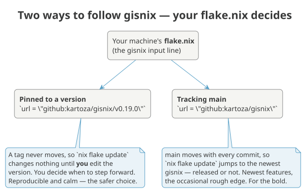
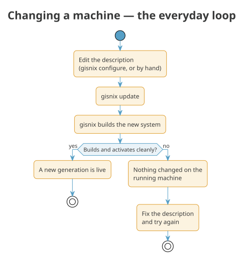

# After the install

The install left you with a running machine and one small folder that
describes it: `~/nixos-config`. Everything about this computer — which
software it carries, its keyboard, its disks, and which gisnix it follows —
is written down there. You change the machine by editing those files and
rebuilding; nothing is configured by clicking around and hoping it sticks.

This page covers the first things worth knowing once you are logged in: where
your machine is described, how to decide which gisnix it follows, and how to
apply a change.

## Where your machine is described

Two files matter to begin with, both under `~/nixos-config`:

- **`hosts/<your-hostname>/config.nix`** — the software your machine has.
  You rarely edit this by hand; `gisnix configure` opens a menu that writes
  your answers back into it.
- **`flake.nix`** — the machine's outermost wrapper. Among a few other
  things, it names *which gisnix* this machine is built from. That single
  line is the subject of the next section.

## Choosing how you follow gisnix

gisnix keeps moving — new hardware support, new software, fixes. Your machine
does not have to move with it in lockstep. One line in `flake.nix` decides
how new gisnix reaches you, and you get to choose the character of your
machine: steady, or always-newest.

{ .kz-figure }

Open `~/nixos-config/flake.nix` and find the gisnix input. It reads one of
two ways.

**Pinned to a version** — the calm, reproducible choice, and the one we
recommend:

```nix
inputs.gisnix.url = "github:kartoza/gisnix/v0.19.0";
```

A version tag never moves. Running `nix flake update` against a pinned input
changes nothing, because the tag it points at is fixed forever. Your machine
stays exactly as it is until *you* decide to step it forward — by editing the
version number to the next release and rebuilding. You read the release notes
first, you move when it suits you, and if a release ever misbehaves you know
precisely which one you are on.

**Tracking main** — the bleeding edge, for those who like it fresh:

```nix
inputs.gisnix.url = "github:kartoza/gisnix";
```

With no version on the end, the input follows gisnix's `main` branch, which
advances with every commit — including work that has not been cut into a
release yet. Now `nix flake update` really does move you: each time you run
it, your next build is on the newest gisnix there is. You get features the
moment they land, at the price of the occasional rough edge.

!!! tip "You can change your mind at any time"
    Switching is a one-line edit followed by a rebuild. Pin today for a quiet
    life; track main for a week when you want a fix that has not been
    released yet; pin again afterwards. Whichever you choose, the
    `flake.lock` file beside your `flake.nix` records the exact gisnix commit
    each build used, so any single build is always reproducible — the choice
    above only changes what the *next* update resolves to.

!!! note "Moving to a newer pin"
    Because a tag is immutable, bumping a pinned version is two steps, not
    one: edit the version in `flake.nix` **first**, then run the update so the
    lock can follow.

    ```bash
    # after editing v0.19.0 -> v0.20.0 in flake.nix
    nix flake update gisnix
    ```

## Applying a change

However you follow gisnix, the loop for changing your machine is the same,
and it is a single command:

{ .kz-figure }

```bash
gisnix update
```

`gisnix update` builds a new version of the whole system from your
description and, if it builds cleanly, switches to it. Add `--flake` when you
also want to pull in newer inputs (a newer gisnix, on whichever tracking you
chose) as part of the same step:

```bash
gisnix update --flake
```

If a build fails, nothing on your running machine changes — you are left
exactly where you were, free to fix the description and try again.

## Getting a gisnix update

gisnix keeps improving upstream — bug fixes, new hardware support, new
software. When a fix is published, pulling it onto your machine is one
command:

```bash
gisnix update --flake
```

`--flake` refreshes the flake inputs — gisnix among them — in `flake.lock`,
then rebuilds. What it actually pulls depends on how you follow gisnix (see
above):

- **Tracking main** — `gisnix update --flake` gives you the newest gisnix
  there is, every time. A fix published upstream is yours on the next run.
- **Pinned to a version** — the pin holds you steady, so `--flake` moves
  nothing until you bump the version in `flake.nix` first. When a release is
  announced with a fix you want, edit the version, then update:

    ```bash
    # in ~/nixos-config/flake.nix, change e.g. v0.20.0 -> v0.20.1, then:
    gisnix update --flake
    ```

If you want *only* gisnix to move and everything else to stay put,
`gisnix update --flake=gisnix` updates that one input and rebuilds. The
`flake.lock` change is left staged so you can see exactly what moved and
commit it (your `~/nixos-config` is yours to keep under git).

## If an update misbehaves

Every successful build becomes a **generation** — a complete, bootable
snapshot of the system. The previous one does not go anywhere. If a new
generation boots to trouble, you can pick the last good one from the boot
menu and carry on as though nothing happened, then investigate at your
leisure. This is the safety net that makes trying a newer gisnix a low-stakes
thing to do.

## What's next?

- [Post-install configuration](post-install.md) — display scaling, the
  panel and dock, and the screenshot / GIF-recording shortcuts.
- [Software bundles](../admin/software-bundles.md) — choosing what your
  machine carries.
- [Keyboard remapping](keyboard.md) — home-row modifiers, layers, and
  push-to-talk.
- [Building your fleet](fleet.md) — going from one machine to many.
