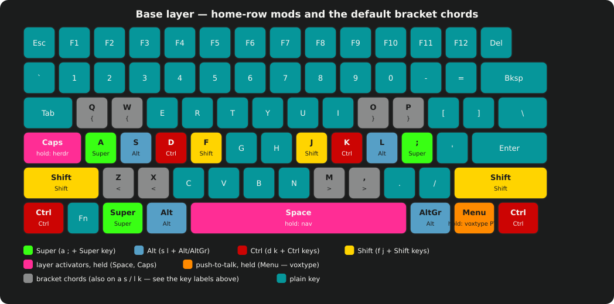
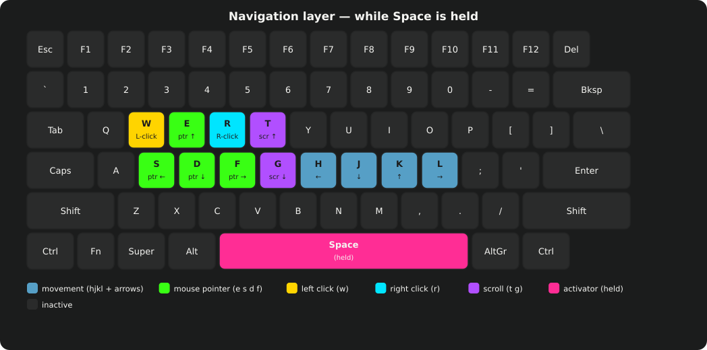
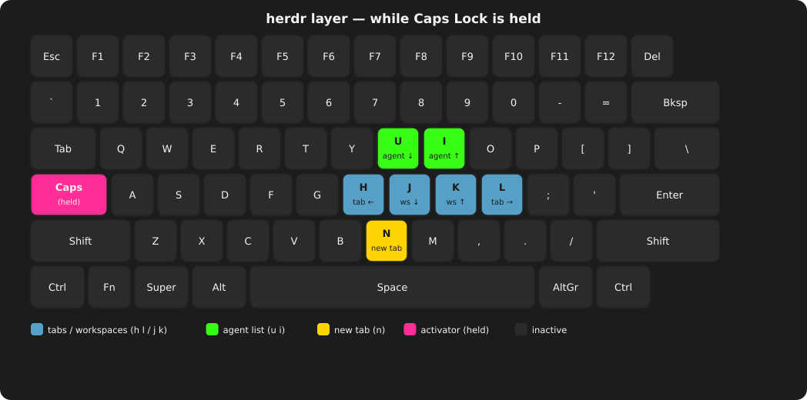
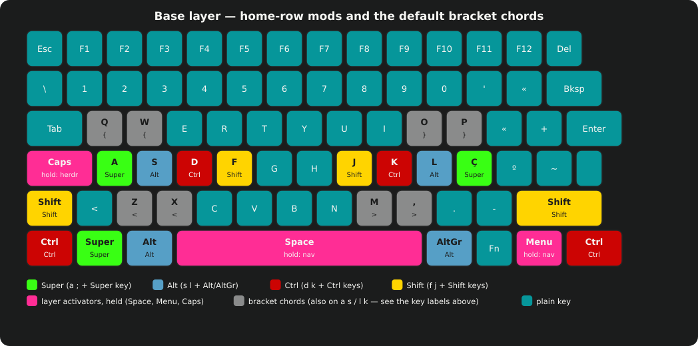
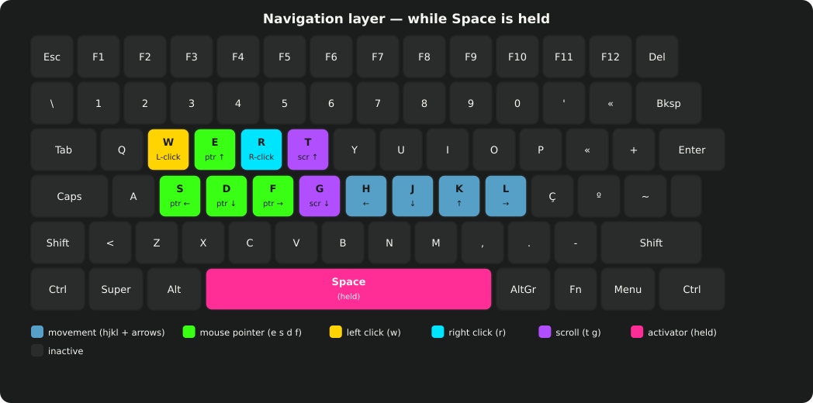
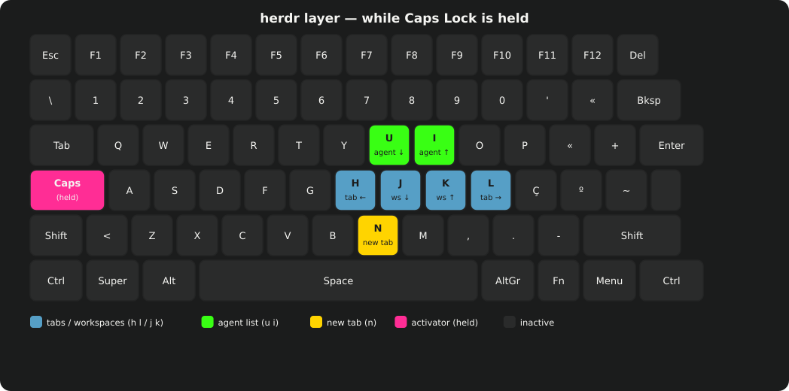

# Keyboard remapping

gisnix ships one keyboard layer built on [kanata](https://github.com/jtroo/kanata), a
userspace remapper that reads raw keyboard events and rewrites them before
X11/Wayland ever sees them. It applies to every keyboard on the machine —
there is nothing to configure per board unless you plug in something with
a genuinely different physical layout (see [Adding a second keyboard](#adding-a-second-keyboard)
below).

Enable it with the `services-device-input` bundle. It is not on by
default; add the line to `hosts/<name>/config.nix` and rebuild.

## Home-row modifiers

Tap a home-row key and it types the letter. Hold it past 500ms and it
becomes a modifier instead. Hold two together and they stack.

| Key | Tap | Hold |
|---|---|---|
| `a` | a | Super |
| `s` | s | Alt |
| `d` | d | Ctrl |
| `f` | f | Shift |
| `j` | j | Shift |
| `k` | k | Ctrl |
| `l` | l | Alt |
| `;` | ; | Super |

Holding `d` and `f` together, for instance, gives you Ctrl+Shift — the two
modifiers combine the same way pressing two physical modifier keys would.
A held modifier applies to whatever key you press next on either hand, so
"hold d, tap c" is Ctrl+C.

The 500ms hold window is deliberate: it is well past the length of an
ordinary keystroke, so nothing you type in the normal course of typing
gets mistaken for a modifier. If you find yourself typing fast enough to
trip it — or slow enough that a real hold feels sluggish — the timeout is
`modHoldTimeout` in `kanata-config.nix`.

## Bracket chords

Press two adjacent keys together — a genuine press-together within 40ms,
not a fast roll — and you get a bracket instead of two letters.

| Chord | Types |
|---|---|
| `q`+`w` | `{` |
| `o`+`p` | `}` |
| `a`+`s` | `[` |
| `l`+`k` | `]` |
| `x`+`z` | `<` |
| `m`+`,` | `>` |

`a`+`s` and `l`+`k` double as home-row mods (Super/Alt, Shift/Ctrl) — press
them more than 40ms apart, which is how you'd normally hold a modifier
anyway, and they behave exactly as the mod table above describes. Only a
genuine press-together inside the window fires the bracket.

The chord *lines* live in `chords-us.kbd` / `chords-pt.kbd` next to
`kanata-keyboard.nix`, which picks between them by the host's
`kanataLayout`. What does **not** ship is the other kind of chord kanata
supports — bigram-to-word expansion, where typing `io` fires a macro that
finishes it as `ion` — because that fires mid-word, on ordinary typing, and
is exactly the kind of surprise a shared default should not spring on
someone. Pass your own `expansionsFile` to `kanata-config.nix` if you want
it — there's no built-in set to turn on.

## Clipboard holds

Hold `x`, `c`, or `v` instead of tapping it, and you get cut, copy, or
paste. Tap normally and you still get the letter.

| Key | Tap | Hold |
|---|---|---|
| `x` | x | Ctrl+X (cut) |
| `c` | c | Ctrl+C (copy) |
| `v` | v | Ctrl+Shift+V (paste) |

Paste is Ctrl+Shift+V, not the more common Ctrl+V, because Ctrl+Shift+V
works in a terminal and plain Ctrl+V doesn't. Cut and copy keep their
ordinary bindings, so holding `c` in a terminal still sends SIGINT via
Ctrl+C, same as tapping it always has.

## Navigation layer

Hold Space or the Menu key (to the left of the right Ctrl key on most
boards) and the layout underneath your left hand becomes a mouse; your
right hand becomes arrow keys and paging.

| Key | Action |
|---|---|
| `e` | mouse up |
| `s` | mouse left |
| `d` | mouse down |
| `f` | mouse right |
| `w` | left click |
| `r` | right click |
| `t` | scroll up |
| `g` | scroll down |
| `h j k l` | left / down / up / right (arrow keys) |
| `n` | Home |
| `u` | Page Down |
| `i` | Page Up |
| `o` | End |
| `m`, `,`, `.` | mouse speed: half, quarter, tenth |

Release Space or Menu and the layer disappears; every key underneath goes
back to typing normally.

## herdr layer

Hold Caps Lock and hjkl drive `herdr`. The `base` bundle installs herdr on
every machine, so this layer is there with nothing to turn on. A tap still
toggles Caps Lock as normal.

| Key | Action |
|---|---|
| `h` | previous tab |
| `l` | next tab |
| `j` | next workspace |
| `k` | previous workspace |
| `u` | down the agent list |
| `i` | up the agent list |
| `n` | new tab |
| `e` | types your email address, if you've set one (see below) |

herdr's own `previous agent`/`next agent` binds ship unbound; the `base`
bundle's `dotfiles/herdr/config.toml` binds them to prefix+u and prefix+i
so `u`/`i` above have something to send. Leave that file alone if you
touch this layer — it is herdr's contract, read once at startup.

### The email key

`e` is silent until you tell it whose keyboard this is. Add a line to your
own user file:

```nix
# users/tim.nix
kartoza.userEmails.tim = "tim@example.com";
```

Rebuild, and holding Caps and pressing `e` types that address. Nothing is
hardcoded per machine: the key resolves the *active login session* to a
username at press time, then looks that username up in
`kartoza.userEmails` — so on a shared machine, `tim`'s hold types
`tim@example.com` and `alice`'s hold types whatever *she* set in
`users/alice.nix`, from the same physical key. An account with no entry
here gets silence when `e` is pressed.

Unmapped characters refuse rather than guess: the generated script only
emits keycodes for `a-z`, `0-9`, `.`, `@`, and `-`, so an email address
using anything else won't type at all rather than typing something close
but wrong. `@` and `-` sit on different physical keys under `us` vs `pt`,
and the script picks the right one from `kanataLayout`.

What is **not** here: an aerc (mail client) layer on Tab hold. gisnix does
not install aerc, so that macro set — compose, reply, file to folders,
contacts — stays a separate opt-in (`aercLayer` in `kanata-config.nix`) for
a host that actually runs it, rather than shipping mail-client keybinds to
everyone by default.

## Layout diagrams

The tables above, drawn out. One diagram set per `kanataLayout` value —
US ANSI (the default) and pt-PT ISO — regenerated straight from the same
key tables `kanata-config.nix` uses, with `gisnix keyboard-diagrams`.

=== "US (default)"

    
    
    

=== "pt-PT"

    
    
    

## Toggling it off

```
kanata-toggle    # disable/re-enable remapping for every kanata instance
kanata-status    # which instances are running
kanata-debug     # service status, input devices, recent logs
```

A raw, unremapped keyboard is sometimes what you want — troubleshooting a
game that reads raw scancodes, or handing the machine to someone who
doesn't use this layout. `kanata-toggle` stops the daemon; the physical
keyboard reverts to whatever it would type without it, and toggling again
turns it back on.

## Adding a second keyboard

The default instance matches every keyboard on the system, so a second
ordinary, row-staggered board picks up the same home-row mods and
navigation layer as the first the moment you plug it in.

Write a *separate* kanata instance only when a board's physical layout
doesn't match a standard keyboard closely enough for the shared layer to
make sense on it — an ortholinear or split board, one you want to keep at
its factory layout, or one that should carry its own chord set. Run:

```
gisnix add-keyboard
```

It lists connected keyboards with their device paths and prints a
`services.kanata.keyboards.<name>` block scoped to the one you pick, ready
to paste into your host's own configuration.
