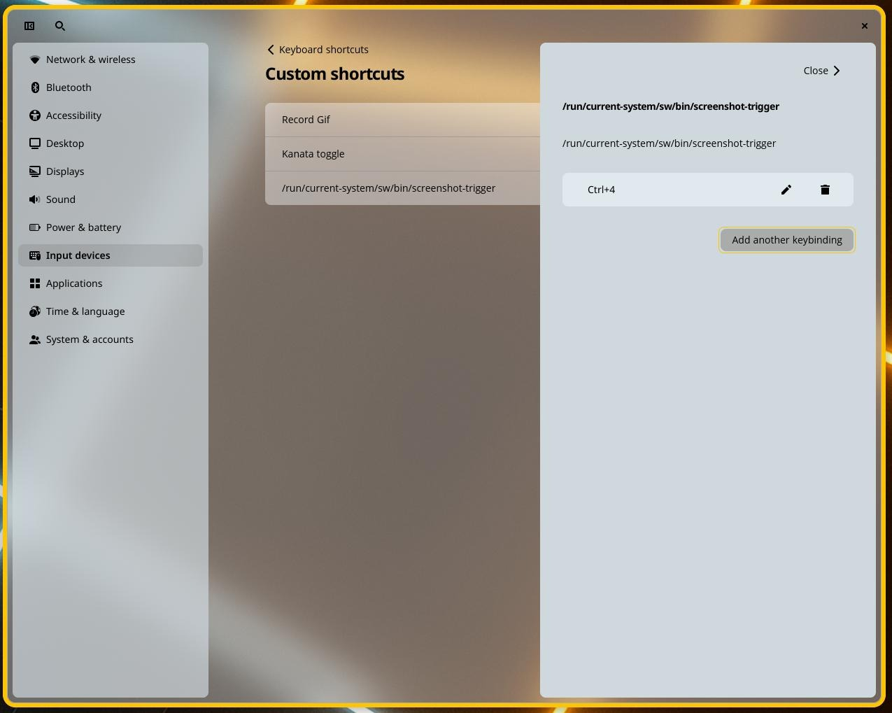
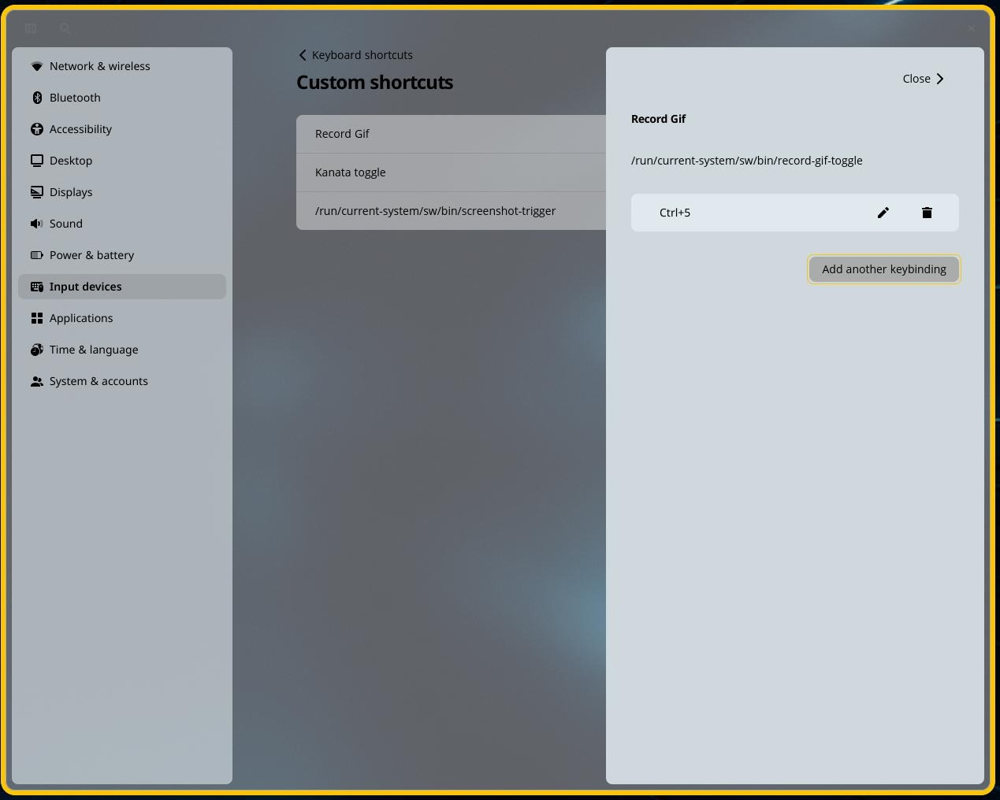

# Post-install configuration

Everything in `~/nixos-config` describes what software your machine
carries. How your desktop *looks and behaves* — scaling, panel layout,
keyboard shortcuts — is a different kind of thing: personal, per-user
state that COSMIC keeps in your home directory (under `~/.config/cosmic`).
You set it once by clicking through **Settings**, and it survives every
rebuild and every GISNIX update, because nothing on this page touches the
flake at all.

This page walks through the settings worth visiting in your first session,
including two commands GISNIX ships specifically so you can put them on a
key.

## Display scaling

Open **Settings → Displays**. Each connected display has its own **Scale**
setting, adjustable in 25% steps. On a HiDPI laptop panel — anything around
2K resolution at 13–14 inches — 125% or 150% is usually where text becomes
comfortable without everything turning cartoonishly large. External
monitors keep their own scale, so a sharp laptop panel and an ordinary
27-inch desktop screen can each be set to what suits them.

The same page handles resolution, refresh rate, and the arrangement of
multiple displays (drag the rectangles so the layout on screen matches the
layout on your desk).

## Arranging the panel and dock

COSMIC splits the bar into two parts, each configured under
**Settings → Desktop**:

- The **panel** — the strip with the app library button, workspaces,
  clock, and status applets. **Desktop → Panel** controls its position,
  size, and which applets appear; the applet list lets you add, remove,
  and reorder them.
- The **dock** — the row of application launchers. **Desktop → Dock**
  controls the same for it.

To put an application on the dock, find it in the app library (the
top-left panel button, carrying the Kartoza logo on a GISNIX machine) or
start it, then right-click its icon and pin it. Drag pinned icons along
the dock to put them in the order your hands expect. QGIS, a terminal, a
browser and a file manager make a sensible opening set for a GIS
workstation; everything else is one app-library search away.

## Custom keyboard shortcuts

COSMIC can bind any command to any key. The controls live at
**Settings → Input devices → Keyboard shortcuts → Custom shortcuts**;
**Add shortcut** asks for a name, the command to run, and the key
combination.

Two things to know before you add one:

1. Give the **absolute path** to the command. The shortcut runs outside
   your shell, so `/run/current-system/sw/bin/screenshot-trigger` works
   where a bare `screenshot-trigger` may not. Everything GISNIX installs
   lives under `/run/current-system/sw/bin/`.
2. The two capture commands below end in `-trigger` and `-toggle` for a
   reason. A COSMIC custom shortcut cannot launch the interactive region
   picker directly — a compositor bug
   ([pop-os/cosmic-epoch#2481](https://github.com/pop-os/cosmic-epoch/issues/2481))
   means a picker started straight from a keybind never gets control of
   the pointer, and the selection silently does nothing. So the bound
   command only pokes a small background service
   (`screenshot-listener`), which owns the picker and does the actual
   capture. Bind the trigger, not the underlying tool.

### Screenshot with annotation

Bind `/run/current-system/sw/bin/screenshot-trigger` — `Ctrl+4` is a
comfortable choice, sitting right above the home row:

{ .kz-figure }

Press the key and a crosshair appears; drag out the region you want (or
press `Escape` to change your mind). The capture opens immediately in
[Satty](https://github.com/gabm/Satty) for annotation — arrows, boxes,
highlights, text — and the result is saved to `~/Pictures/Screenshots`.

The command takes an optional mode argument, so you can bind variants to
their own keys:

| Command | What it captures |
|---|---|
| `screenshot-trigger` | Drag out a region (the default) |
| `screenshot-trigger region-repeat` | The same region as last time, no picker — for a series of captures of one on-screen area |
| `screenshot-trigger screen` | The whole screen |

### GIF screen recording

Bind `/run/current-system/sw/bin/record-gif-toggle` — `Ctrl+5` pairs
naturally with the screenshot key beside it:

{ .kz-figure }

One key does both ends of the job. Press it once: the crosshair appears,
you drag out a region, and recording starts (a notification confirms the
size). Press it again: recording stops, the video is converted to a GIF,
and the file lands in `~/Videos/Recordings` — the folder opens so you can
grab it. A second copy at half the dimensions is saved beside it
(`…-half.gif`), sized for chat windows and issue trackers where the
full-size one is too heavy. Short GIFs of a map interaction, a dialog sequence, or a bug in
motion drop straight into an issue tracker or a chat window where a video
file would be a chore.

If you would rather have a fixed-length recording, an argument caps the
duration in seconds — `record-gif-toggle 30` stops itself after half a
minute if you have not stopped it first.

!!! note "If pressing the key does nothing"
    The background service that owns the region picker may not be
    running. Check it with:

    ```bash
    systemctl --user status screenshot-listener
    ```

    Logging out and back in restarts it.

### On-screen keystrokes

With the `desktop-multimedia` bundle on board, bind
`/run/current-system/sw/bin/wshowkeys-toggle` — `Ctrl+6` continues the
row. One press overlays every keystroke at the bottom of the screen,
each character drawn as a keycap (the Libertinus Keyboard face, SIL
OFL); press again to turn it off. Made for pairing with the GIF
recorder: viewers see what you typed, not just what happened. Set
`WSHOWKEYS_FONT` (a Pango spec like `monospace 28`) before toggling if
you want a different face.

### Other commands worth a key

Anything on the system can be bound the same way. One that earns a spot
is `/run/current-system/sw/bin/kanata-toggle`, which suspends and resumes
the [keyboard remapping](keyboard.md) layer — useful when a game or a
remote-desktop session wants your keyboard raw.

## Appearance

**Settings → Desktop → Appearance** switches between light and dark mode
and sets the accent colour; **Desktop → Wallpaper** does what it says.
COSMIC's tiling can be toggled per workspace from the tiling applet on
the panel (or `Super+Y`) if you prefer windows that arrange themselves.
The defaults are all reasonable; adjust what bothers you and leave the
rest.

## What's next?

- [After the install](after-install.md) — how your machine is described,
  and how updates reach it.
- [Keyboard remapping](keyboard.md) — the home-row modifiers and
  navigation layer that are already active.
- [The workflow it unlocks](workflows.md) — living declaratively day to
  day.
