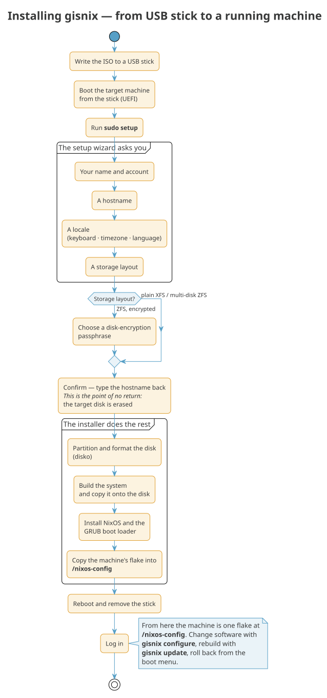
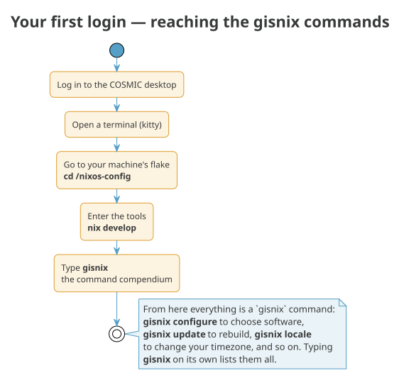

# Quickstart

Getting gisnix onto a machine is a short journey: you write the installer
to a USB stick, boot from it, connect to the network, answer a few
questions, and reboot into a working system. This page walks the whole way,
from the stick to the moment you have gisnix's commands at your fingertips.

Here is the shape of it before we begin.

{ .kz-figure }

!!! danger "Installing gisnix erases the target disk"
    The installation **completely wipes the disk you install onto**. Every
    existing partition, operating system and file on it is destroyed, and
    the data **cannot be recovered** afterwards. Back up anything you care
    about *before* you start, and be certain you have chosen the right disk.
    gisnix and Kartoza accept **no responsibility for lost data** — you
    install at your own risk.

## 1. Get the installer

Download the ready-made image from the
[latest release](https://github.com/kartoza/gisnix/releases/latest), or, if
you already run Nix, build it yourself:

```bash
git clone https://github.com/kartoza/gisnix
cd gisnix
nix build .#nixosConfigurations.installer.config.system.build.isoImage
```

Either way you end up with a `.iso` file — the installer.

## 2. Write it to a USB stick

Copy the ISO onto a USB stick. If you have not done this before,
[making a bootable USB stick](bootable-usb.md) shows you how on Windows,
macOS and Linux. The stick becomes the installer you boot from; its own
contents are replaced, so use one you can spare.

Want to try the whole thing without any hardware first? `nix run
.#test-install` builds the installer and boots it in a virtual machine with
a throwaway disk, so you can rehearse the steps below safely.

## 3. Boot from the stick

Start the target machine from the USB stick. Most machines have a key you
hold at power-on to choose the boot device (often F12, F10 or Esc); on some
you set the boot order in the firmware settings. gisnix needs **UEFI** boot
with **Secure Boot turned off**.

You arrive at a plain text screen, logged in and ready. Nothing has been
written to the machine's disk yet.

## 4. Connect to the network

The installer builds your system from packages it downloads, so it needs a
working internet connection. If you are on a cable, you may already be
online. For wireless, open the network chooser:

```bash
sudo nmtui
```

Pick *Activate a connection*, choose your network, and enter its password.
When you leave `nmtui` you should have a connection. (A wired connection
usually needs nothing at all.)

!!! tip "No network? Tether an iPhone over USB"
    If the only internet you have is your phone, an iPhone will do. Plug it
    into the machine with a cable and turn on **Personal Hotspot** on the
    phone. The installer already runs the pairing service that makes this
    work, so the phone shows up as a wired connection — tap **Trust** on the
    phone when it asks, then activate that connection in `nmtui`. Nothing to
    install or configure; it works on the installer and on the machine you go
    on to install. See [Supported hardware](hardware.md#tethering-from-an-iphone).

## 5. Run the installer

Now start the setup wizard:

```bash
sudo setup
```

It asks you a handful of questions, one screen at a time:

- **Your account** — your name, a username and a password. You can also
  have it fetch your SSH public keys from your GitHub username, so you can
  log in remotely from the first boot.
- **A name for the machine** — its hostname.
- **A locale** — your keyboard layout, timezone and language, chosen
  together as one preset.
- **How to lay out the disk** — the recommended choice is ZFS on a single
  disk with encryption, which asks you for a passphrase. (Plain disks and
  multi-disk layouts are offered too; see [Storage modes](../admin/storage-modes.md).)

!!! danger "Point of no return"
    The next step **erases the disk you selected**. There is no undo. Make
    sure you picked the right disk and that anything important on it is
    backed up elsewhere.

When you have answered everything, the wizard asks you to **type the
hostname back** to confirm. This is the point of no return: from here the
disk is erased and the install proceeds on its own — it partitions the
disk, builds your system, installs it, and leaves a copy of the machine's
description in your home directory. There is nothing more to do but wait.

!!! tip "See it first, safely"
    `setup --mock` runs the whole wizard without touching a disk or the
    network — useful for a dry run before you commit.

## 6. Reboot into your new machine

Remove the USB stick and restart. If you chose encryption, the machine asks
for your passphrase as it starts. Then you are looking at a login screen.

What you have now is a **minimal but complete** gisnix machine: an
encrypted ZFS disk and the COSMIC desktop, ready to grow into whatever you
need.

## 7. Your first login

Log in with the account you created, and the COSMIC desktop appears. From
here, everything you do to the machine runs through one command — and this
is how you reach it.

{ .kz-figure }

Open a terminal — gisnix uses **kitty**, which you will find in the
applications menu. In it, go to your machine's description and step into
gisnix's tools:

```bash
cd ~/nixos-config
nix develop
```

The first `nix develop` takes a moment while it fetches those tools. When
it finishes, type:

```bash
gisnix
```

and you are looking at the **command compendium** — the full list of things
gisnix can do for this machine. `gisnix configure` opens a menu of software
to add; `gisnix update` rebuilds after a change; `gisnix locale` moves your
clock when you travel. Typing `gisnix` on its own always shows the list.

!!! note "Onto the latest desktop"
    The desktop you just booted was installed from a fully-cached *stable*
    build so the install was quick. Your first `gisnix update`, once you are
    online, moves the machine onto the same up-to-the-minute COSMIC every
    other gisnix host tracks. It may take a little longer than a routine
    update, but only this once.

## What's next?

- [After the install](after-install.md) — where your machine is described,
  how to pull gisnix updates, and pinning versus tracking the latest.
- [Understanding gisnix](../why.md) — the ideas behind what you just
  installed.
- [Software bundles](../admin/software-bundles.md) — choosing what your
  machine has.
- [Building your fleet](fleet.md) — going from one machine to many.
