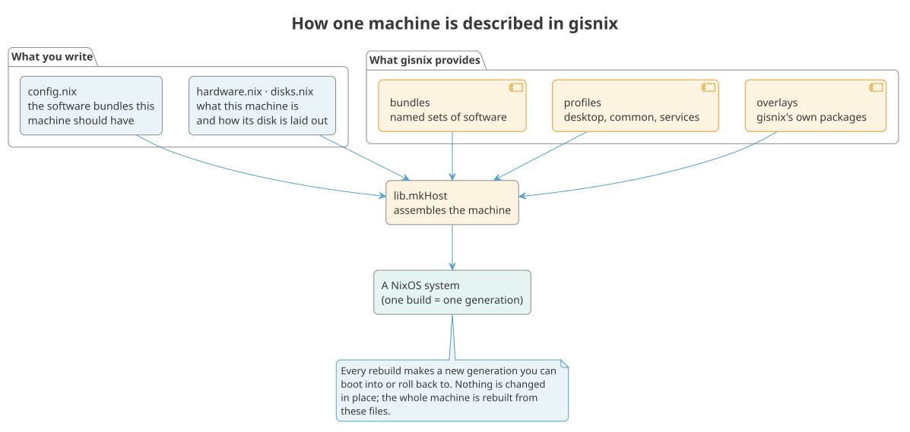
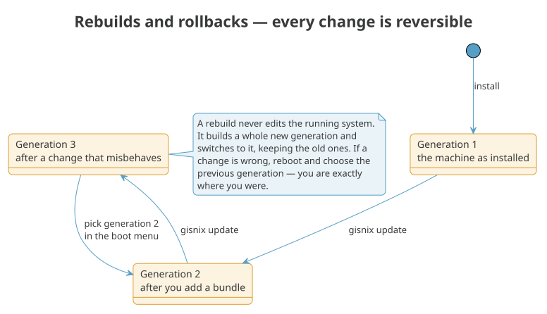
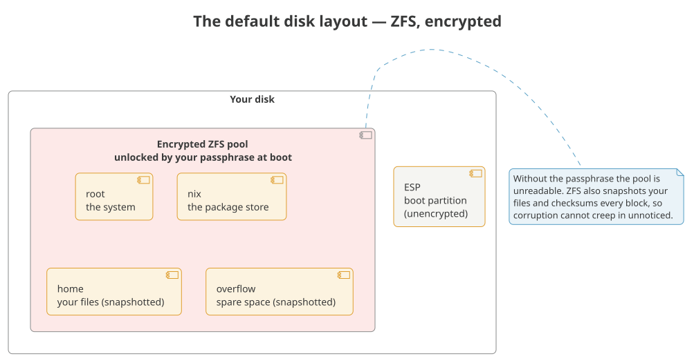
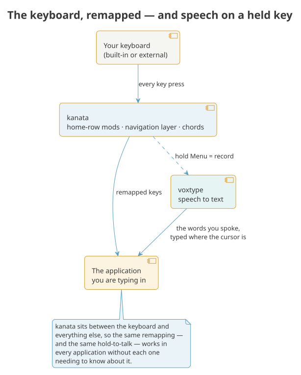
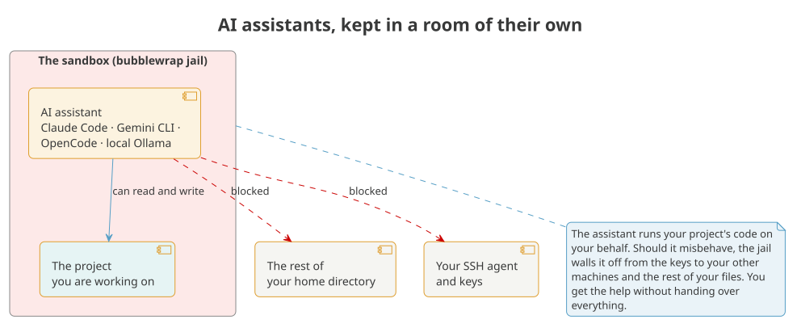
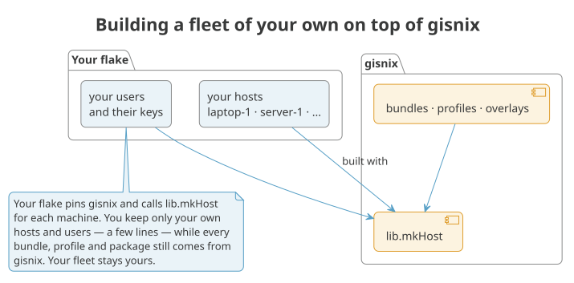

# Understanding gisnix

If you have ever set up a computer for serious geospatial work, you know
how much of the effort goes into things that have nothing to do with maps.
You install an operating system, then a desktop, then QGIS, then the dozen
smaller tools you have come to rely on. You configure the disk, the
keyboard, the backups. A year later you buy a new laptop and do the whole
thing again from memory, and it never comes out quite the same.

gisnix exists to make that setup a description rather than a chore. It is a
version of the Linux operating system, built on NixOS, that already knows
what a geospatial workstation needs and writes the whole machine down in a
single file you can keep, copy and change. This page explains the ideas
behind it, so that the rest of the documentation makes sense.

## A machine described in a file

Think of a recipe. A recipe does not *contain* a cake; it contains
everything needed to produce the same cake again and again. gisnix treats a
computer the same way. Instead of a machine you have installed and tinkered
with until it works, you have a short description — which software, which
disk layout, which keyboard — and gisnix builds the machine from it.

{ .kz-figure }

You write two kinds of thing. The first is what makes this machine *this*
machine: its name, its hardware, how its disk is laid out. The second is
what software it should have, chosen from gisnix's collection. gisnix
supplies the rest — the desktop, the system services, its own packages —
and assembles them into a running system.

The important part is what happens when you change that description. gisnix
does not edit your machine in place. It builds a new version of the whole
system and switches to it, keeping the previous one. That new version is
called a *generation*, and every generation is still there in your boot
menu. If a change goes wrong, you restart, pick the previous generation,
and you are exactly where you were. Nothing is ever left half-changed.

{ .kz-figure }

The everyday loop, once a machine is running, is short: change the
description, run `gisnix update`, and gisnix builds and switches to the new
generation. If the build fails, the running machine is untouched — you fix
the description and try again.

{ .kz-figure }

## Software you ask for by name

Most systems make you manage software one package at a time, and leave you
to remember that this tool needs that library which needs a particular
service running. gisnix groups software into **bundles** — named sets like
`desktop-gis` or `terminal-ai` — and each bundle knows what it depends on.

When you ask for the GIS bundle, the desktop it needs to run in comes with
it, because the bundle says so. You are describing a capability you want,
not assembling a parts list. The command `gisnix configure` shows you the
whole collection as a menu and writes your choices back into that one
description file.

{ .kz-figure }

QGIS sits at the centre of that collection. gisnix carries the current QGIS
releases and, alongside them, twenty-three older versions going back to
1.8 — each built in its own isolated way, so an old project that needs an
old QGIS can have it on the same machine as your current work without the
two interfering. Some of the very oldest are still rough — a handful need a
long-obsolete WebKit that is awkward to build, and smoothing those over is
ongoing work — but the recent releases are solid.

Treating QGIS as a first-class citizen has two more consequences worth
knowing. If you want to try a fix before it is released, building QGIS from
its development (`master`) branch is a single command. And if you want to
work *on* QGIS rather than only with it, a companion project,
[qgis-dev-env](https://timlinux.github.io/qgis-dev-env/), sets up a complete
development environment — formatting to QGIS's own coding standards,
compiler caching, and the build tooling that goes with it.

## Storage you can trust, encrypted by default

A field laptop carries client data, and laptops get lost. So when gisnix
installs a machine, its recommended disk layout is ZFS with encryption
switched on: the disk is scrambled, and it asks for your passphrase each
time the machine starts. Without the passphrase the disk is unreadable.

ZFS gives you more than encryption. It takes snapshots — frozen pictures of
your files at a moment in time — that you can roll back to, and it checks
every block it reads so quiet corruption cannot creep into your data
unnoticed. If you would rather use a plain disk, or spread your data across
several disks for resilience, gisnix offers those layouts too. But the
encrypted single disk is the one a laptop should be running, so it is the
default.

{ .kz-figure }

## Built around the keyboard

gisnix assumes you would rather keep your hands on the keyboard than reach
for the mouse, and it sets the machine up that way from the start. A tool
called kanata gives you *home-row modifiers* — hold a letter key and it
acts as Control or Shift — along with a navigation layer for the arrow keys
and cursor movement, so you rarely leave the middle row of the keyboard. It
is all software, so it works on a laptop's built-in keyboard just as well
as on an expensive ergonomic one.

There is one more trick worth knowing. Hold **right Ctrl** and speak, and
gisnix types what you said into whatever you are working in — an email, a
map's label field, a terminal. It runs entirely on the machine's CPU, so
no graphics card is needed, and it works everywhere: speech is wired in as
just another key the keyboard understands, without each program needing to
know about it. (Right Ctrl is the key because every keyboard has one.)

{ .kz-figure }

## Assistants kept in a room of their own

gisnix ships the current crop of AI coding assistants, and treats them with
appropriate caution. An assistant runs commands and reads files on your
behalf, which is useful right up until one misbehaves. So each assistant
runs inside a *sandbox* — a locked room that can see the project you are
working on but not the keys to your other machines, not your wider home
directory, not your SSH agent. You get the help without handing over the
keys to everything.

{ .kz-figure }

## The desktop and the shape of the whole thing

The desktop is COSMIC, a modern environment built on Wayland, and it is the
same on every gisnix machine. That sameness is the point: what you learn on
one gisnix computer, you already know on the next.

Small things are set up so you do not have to hunt for them. Capturing the
screen is one: take a still or a short GIF and, for a still, mark it up
before you share — arrows, numbered circles, a blur over anything private —
using satty, a capture tool built for Wayland. It is the kind of thing every
GIS professional reaches for when explaining a map or filing a bug, so it is
there from the start.

Underneath, everything you have read about here is one flake — the Nix term
for a self-contained, reproducible description. The same description builds
your machine, builds a test version of it in a virtual machine, and builds
the installer you started from. When you are ready to run a fleet of
machines rather than one, a small flake of your own can build on gisnix's
foundations while you keep only your own machines' details. Your fleet stays
yours; the ground it stands on stays gisnix.

{ .kz-figure }

## Installing, start to finish

When you install gisnix, the journey looks like this. You answer a handful
of questions, confirm once, and the installer does the rest — partitions the
disk, builds the system, installs it, and leaves the machine's description
in your home directory so you can change it later.

{ .kz-figure }

## What have we learned?

- gisnix describes a whole machine in one file and *builds* it from that
  description, rather than being installed and tinkered with by hand.
- Every rebuild is a new generation you can roll back to from the boot
  menu, so a bad change is never a dead end.
- Software comes in bundles you ask for by name, with QGIS and the
  geospatial stack at the centre.
- The default disk layout is ZFS, encrypted with a passphrase at boot, with
  snapshots and integrity checking.
- The machine is built around the keyboard — home-row modifiers, a
  navigation layer, and speech-to-text on a held key.
- AI assistants run sandboxed, able to help without reaching your keys.
- It is all one reproducible flake, and you can build your own fleet on top
  of it.

## What's next?

- [Quickstart](user/quickstart.md) — put gisnix on a real machine.
- [Software bundles](admin/software-bundles.md) — the collection, in detail.
- [Storage modes](admin/storage-modes.md) — ZFS, encryption and the
  alternatives.
- [Building on gisnix](developer/downstream-flakes.md) — a fleet of your
  own.

---

Made with 💗 by [Kartoza](https://kartoza.com) | [Donate!](https://github.com/sponsors/timlinux) | [GitHub](https://github.com/kartoza/gisnix)
